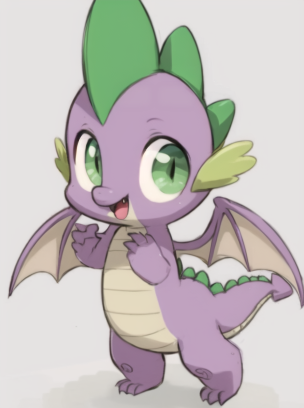
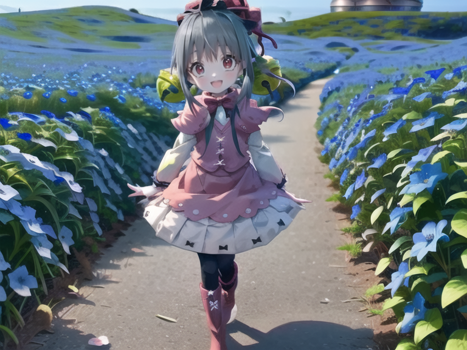
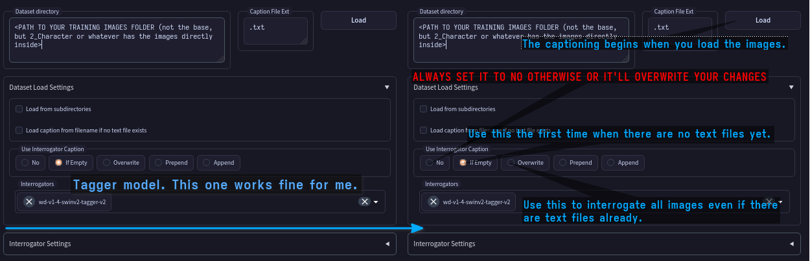
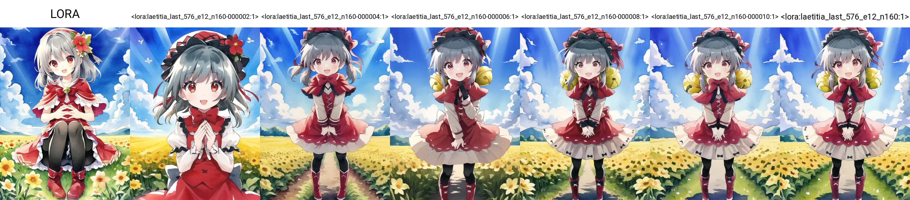
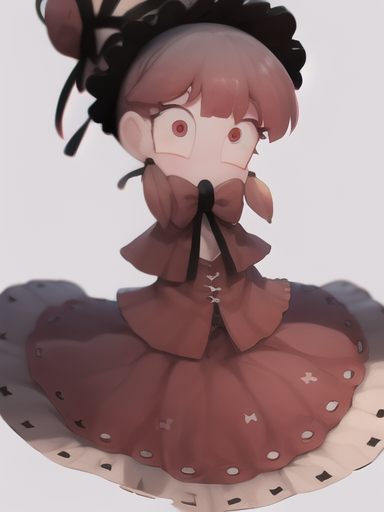
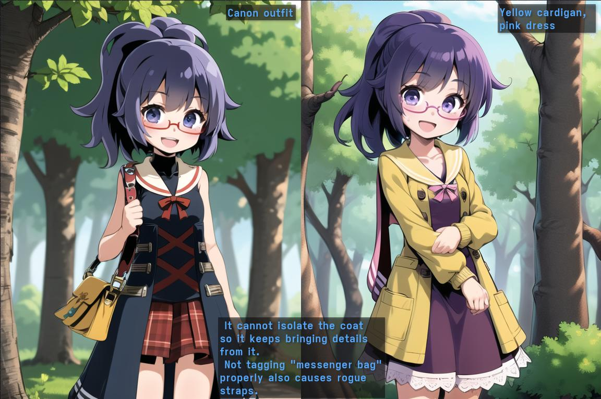
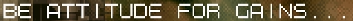
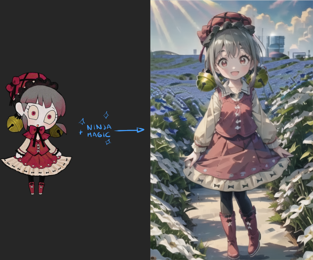
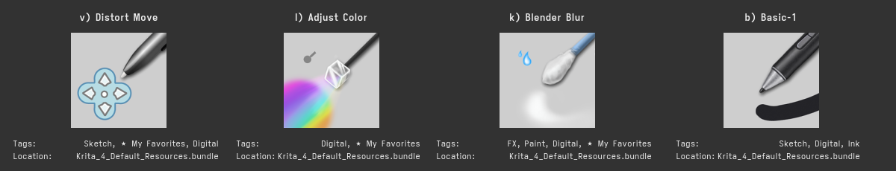

# LoRA 训练指南
-> **Stable Diffusion LoRA 训练的科学与指南** <-  
[原文地址](https://rentry.org/59xed3)  
!!! 提示：这个版本是译本，并且添加了我自己的理解，以及教学。  
!!! 提示：这不是安装指南，而是一份提高训练结果的手册，包含各项设置的详细说明，并提供关于如何在图像质量较差或数量不足的情况下训练角色的技巧。  
!!! 警告：由于LyCORIS的使用频率增加，我将开始称呼常规LoRA为LoRA-LierLa。如果文中未特别指明LoRA类型，请默认为LoRA-LierLa。不同的LyCORIS类型将以LyCORIS-(类型)命名，如LyCORIS-LoKR。若没有具体说明，则该内容适用于大多数LyCORIS类型。  
!!! 提示：即使只有8GB VRAM，也可以进行SDXL训练！


### 20230807
我已经找到了如何在我的硬件上训练并运行SDXL，因此在这里开始了一个SDXL的章节。[这里](#sdxl).

### 20230801
我收到了一些关于如何从现有LoRA模型继续训练的问题。
虽然之前没有尝试过这种方法，但它对那些只需要"再稍微优化一下"的模型特别有效，因此我加入了 [恢复训练](#恢复训练) 一节，专门介绍该策略。  
此外，我还测试了一种多阶段的训练策略。至少在第一次实验中，它表现得非常出色。具体来说，大部分epoch采用线性调度器训练，然后用余弦或对数调度器进行额外的几次训练。

### 20230731
整个周末都在实验LyCORIS，我觉得这个部分现在可以告一段落了。  
它们在风格和概念方面表现出色，但在学习“简单”角色时才有较好的效果。因此，我新增了一个[角色难度](#角色难度)部分。回想起来，我应该早点加上这个部分。  
考虑到这一点，**我不太推荐使用LyCORIS（不过LoCon还不错）来训练角色**，除非是属于较低难度类别的角色。对于“现实中可能存在”的动漫女孩，它能处理得不错，但除此之外，你可能需要调整过多的设置、花费过多时间训练，或者使用超过8GB VRAM的设置，这就抵消了它在理论上的一些优势。  
**不过对于风格和概念来说，它们似乎是非常合适的选择**。这些通常需要更长的训练周期，所以即使稍慢一点或者多训练几个epochs也不是大问题。因为它似乎可以很好地处理10000+的数据集，通常还能维持较小的模型尺寸。它对学习率的抑制也对风格和概念类任务有一定好处，因此LyCORIS在这些方面表现很好，至少LoCon和可能DyLoRA是如此。  
- 重新评估了[Min. SNR Gamma](#最小snr-gamma)的结果，得出了更具结论性的结果。  
- 增加了[Scale Weight Norms](#权重标准化缩放)的相关信息。  
- [LyCORIS (LoHA/LoCon/Etc)](#lycorislohaloconetc)部分基本完成。  
- 重新审视了[学习抑制](#学习阻尼)部分。  
- 关于[损失函数](#损失loss)的一些笔记。  
- 进一步更新了术语表。

### 20230728
- 总体上更新了更多部分。
- 虽然从一开始就知道LoRA可以与checkpoints混合使用（最早的LoRA生成方法是创建大型checkpoints，而不是我们今天使用的小文件），但我看到有人将其提到为一种“新事物”。因此，我决定在这里详细说明一下：[将LoRA混合到checkpoints中](#将lora混合到checkpoints中)，以引起更多关注，让大家知道这是一个可以利用的功能。
- 扩展了[加权训练](#加权训练)的部分内容。
- 进一步更新了[LyCORIS (LoHA/LoCon/Etc)](#lycorislohaloconetc)部分。
- 什么？SDXL 1.0已经发布了吗？我得去看看。据说CivitAI正在举办一个比赛，如果我的机器能胜任，我会在这里添加一些信息，帮助参赛者。我自己不会参加，上传模型浪费太多PR时间，除非有人要求，所以这纯粹是为了研究。
  - 噢，看来8GB VRAM不够运行SDXL。这真是不幸。

### 20230727
* [LyCORIS (LoHA/LoCon/Etc)](#lycorislohaloconetc)部分进行了相应更新。
* 使关于低网络阶/alpha值需要更高学习率的警告更加醒目，因为似乎有些人忽视了这一点。
  * 请注意，自适应优化器应该已经考虑到了这一点，因此只有在手动设置学习率时才需要注意。
  * 尽管如此，给自适应优化器多加几个epochs可以帮助抵消抑制效果。
- 对[稀有角色/原创角色指南](#稀有角色oc指南)进行了详细更新。
- 我会很快进一步扩展权重部分的内容。

### 20230726
现在LyCORIS已直接与sd-webui集成，这意味着它的集成不再是个问题了。  
这消除了大多数作为容器的LyCORIS的问题，使其作为训练工具更加可行，因为它现在已成为生态系统中的一级公民。  
这是个好消息！

### 20230722
稍微修改了[初始设置](#初始设置)部分。
当SDXL 1.0发布时，我会尝试一下。我不确定8GB的显存能否胜任，但如果可以，我会进一步扩展相关内容。  
到目前为止，我已经对`Prodigy`进行了足够多的测试，认为它不错，请记住这一点。

### 20230720
基于最新的知识对多个部分进行了大幅重写，移除了不再重要的内容，并强调了**不应再手动设置训练率，使用自适应优化器以减少猜测工作**。只有在没有足够的VRAM或想要挑战时，才需要手动设置。

自从这份指南开始以来，很多事情已经发生了变化，不是吗？现在第一次尝试训练就变得非常简单了。我觉得自从`DAdaptAdam`之外，我在角色训练上几乎没遇到过困难，最多就是需要“再多两个epochs”或者“稍微增加一些rank”或者“清理标签”。
继续保持这份指南的解释性和细节性仍然是个好主意，这样就可以在“*通俗知识*”和“*真正的科学论文*”之间找到平衡。

* 增加了关于兽耳角色的部分，因为我一直被问到这个问题。
* 我应该移除脚本部分吗？现在大多数人似乎都在使用bmaltais的Kohya GUI，在大多数情况下，这是一个不错的选择。
  * 我自己仍然使用脚本，主要是为了我在外出或睡觉时能批量处理工作，并在完成后关闭电脑，但很少有人会这样做，他们可能也已经知道如何编写一些脚本了。
* 添加了一些关于在多个checkpoints中测试模型的内容，因为现在比起指南刚开始时更加相关了。
* 相应更新了[网络维度/Rank](#网络维度rank)部分。
* 稍微更新了[LyCORIS (LoHA/LoCon/Etc)](#lycorislohaloconetc)部分。我并不太喜欢它们用于角色训练，但它们在风格和概念、服装等方面表现得非常出色。
* 添加了关于种子的简短说明，因为我现在见证了它确实在某些情况下有影响。以防万一。

## 前言
本指南旨在与其他有关LORA训练的指南并存。  
它的定位是介于“枯燥的科学论文”和“为奶奶和新手准备的LoRA入门指南”之间的中间地带，尽我所能详细说明各种选项的效果及其作用，并分享我的结果以及一些小贴士和技巧。

虽然我很想让这份指南包含大量图片，但如果有人使用手机或较慢的网络连接查看，图片过多会带来不便。所以我会尽量通过描述来表达内容。

我的最终目标是让每个人都能训练角色，特别是那些冷门或被遗忘的角色。如果某些技巧对风格或概念显然有帮助，我也会提到。

此外，我还会指出一些可以帮助提升你在CivitAI或类似服务上上传结果的设置，并提供相反的建议，帮助你根据个人喜好调整模型。

## 安装Kohya的训练脚本
克隆 https://github.com/kohya-ss/sd-scripts 并按照安装说明进行操作。  
!!! danger **不要将其安装在与你的webui相同的位置！请创建一个新的Python虚拟环境！**  
⚠ 该脚本使用不同的库版本，**会破坏你的webui**。⚠    

学会使用 [Anconda](https://www.anaconda.com/download) 是非常必要的，Anconda 可以区分不同程序的虚拟环境。  
按照安装说明完成操作后，获取底部的bash（linux）或powershell（windows）脚本，并根据需要编辑路径以启动Kohya的脚本。随着我不断测试，我会添加更多的命令行参数。

!!! 警告 现在某些功能需要单独添加，比如DAdaptation，我会根据需要在适当位置标注。

### Windows Anconda逐步安装教程

#### 安装 CUDA 11.8 toolkit
[下载地址](https://developer.nvidia.com/cuda-11-8-0-download-archive?target_os=Windows&target_arch=x86_64)

#### 安装 git
[下载地址](https://git-scm.com/download/win)

#### 安装 Visual Studio 2015, 2017, 2019, and 2022 redistributable
[下载地址](https://aka.ms/vs/17/release/vc_redist.x64.exe)

#### Anconda
1. 打开 Anconda 的[下载地址](https://www.anaconda.com/download)，你可以注册下载也可以点击跳过下载。  
2. 下载并且安装好之后，点击 **Anconda Prompt** ，输入：
```
conda create -n kohya_ss python=3.10.11
conda activate kohya_ss
```
然后输入下面代码判断是否安装并且成功激活虚拟环境。
```
python --version
```

#### 安装部署

1. 在安装目录的位置打开终端（命令提示符、CMD）。
2. 克隆仓库：
```
git clone --recursive https://github.com/bmaltais/kohya_ss.git
```
3. 进入安装目录
```
cd kohya_ss
```
4. 运行命令
```
.\setup.bat
```

### Ubuntu 23.04逐步安装指南

#### Ubuntu >=23.04 不提供Python 3.10
虽然在sd-webui中问题不大，但Kohya脚本需要非常特定的版本。你需要进行一些强制操作。这还有一个意外的好处：相比默认设置，性能提升了约5%，总是让人欣喜的。  
你必须构建一个独立的Python 3.10版本，并将其用于虚拟环境(venv)。获取最新的Python压缩包，解压至某处并打开终端进行操作。  
* 确保安装了`libssl-dev`（否则pip将无法下载任何内容）  
* 确保安装了`libbz2-dev`（这是Kohya脚本所需的默认库）  
* 当然，还要安装build-essential等依赖库。类似tk（用于tkinter）的库不是必须的（??）。  
运行命令`sudo apt install libssl-dev libbz2-dev`即可完成。

##### 构建Python
```sh
./configure --enable-optimizations --with-ensurepip=install --prefix="/mnt/DATA/AI/Python310" --with-ssl-default-suites=openssl
make -j8 && make install   # 无需root权限，因为它会安装在本地文件夹中。
```

##### 设置特殊虚拟环境
一旦Python 3.10.x安装完成，我们将使用该特定版本来设置虚拟环境。
```sh
/mnt/DATA/AI/Python310/bin/python3.10 -m venv venv   # 当然，根据需要更改路径。
. venv/bin/activate                                  # 我们现在应该可以继续操作了。
```

##### 幻影库版本
安装完成后，xformers可能没有被安装，因为Linux系统默认的PyTorch安装包与其不兼容。解决办法是先安装默认包，然后覆盖一些版本。这些版本已被证明可以正常工作。
```sh
pip install torch==2.0.0 torchvision==0.15.1 -f https://download.pytorch.org/whl/cu117
pip install xformers==0.0.17
```

### bmaltais的Kohya-ss
[kohya_ss](https://github.com/bmaltais/kohya_ss#installation) 是一个替代设置，经常与Kohya脚本同步，并提供了一个更易用的用户界面。  
点击链接查看安装说明。与前面提到的一样，**不要**将其安装在与你的webui相同的位置。  
这与直接使用脚本效果相同，但更易于操作，并且推荐Windows用户使用。  
选项名称和功能基本相同，因此可以用它来获得更简便的体验。

#### Ubuntu 23.04
- 使用与前面相同的步骤来构建Python并设置特殊的venv。然而，`tkinter`在kohya-ss中会用到，因此在构建Python 3.10时，确保安装了`tk8.6-dev`（运行命令：`sudo apt install tk8.6-dev`）。
  - `make`的输出将在接近末尾处显示一个`The necessary bits to build these optional modules were not found:`列表。确保`tkinter`不在其中。
- 安装脚本将完成其他所有设置。

## 秘籍

### 术语表

| 术语             | 描述                                                                                                               | 术语          | 描述                                                                                                               |
| ---------------- | ------------------------------------------------------------------------------------------------------------------ | ------------- | ------------------------------------------------------------------------------------------------------------------ |
| 模型             | 也称为"checkpoint"，是训练的结果，通常以包含“权重”的单一文件形式分发                                           | 嵌入（Embed） | 也称为"textual inversion"，是一种只训练文本编码器的较旧风格                                                          |
| 训练    | 对模型进行训练的通俗说法                                                                                           | 超网络         | 类似于嵌入，但作用于Unet系统                                                                                        |
| 忍者卷轴         | Kohya脚本的完整文档（日语）的有趣昵称                                                                              | 主题           | 将角色、物体、车辆、背景等训练到模型中                                                                               |
| Kohya            | 训练脚本及其他Stable Diffusion相关技术的开发者                                                                     | 风格           | 训练模型以再现特定的美学风格                                                                                        |
| WebUI            | 最常用的Stable Diffusion生成工具                                                                                   | 概念           | 训练模型再现某种姿势或构图                                                                                          |
| 扩展 | WebUI的扩展，如插件。可以从WebUI的扩展选项卡中添加                                                                  | 训练集         | 训练图像和标签的组合                                                                                                |
| Voldy            | AUTOMATIC1111，webui的作者                                                                                         | 蒸馏           | 从较大的模型中提取LORA的通俗说法                                                                                    |
| Unet             | 控制机器学习图像及一些未知决策/关联属性的系统                                                                      | 过拟合         | 模型试图过于激进地再现训练集                                                                                        |
| 文本编码器（TE） | 将提示词中的文字或符号转换为AI理解的数据的系统                                                                     | 油炸（Deep-frying） | 生成图像时颜色非常饱和的效果，通常是由于较高的CFG比例引起的                                                           |
| CLIP             | 一种文本编码器，通常是我们训练的对象。Stable Diffusion v2模型使用OpenCLIP                                           | 图像标签器     | 一个较小的AI，它会为图像中识别出的事物提供标签                                                                       |
| 网络维度（Net Dim） | 也称为"rank"，是模型的总容量，通常反映为较大的文件                                                              | 推理           | 生成AI输出的过程。可以作为“生成”的同义词                                                                             |
| AI               | 实际上这更接近于“机器学习”，但非正式地称其为“AI”更容易                                                            | LyCORIS        | 超越常规方法的LoRA，其他Rank自适应实现，LoRA的不同实现方式                                                           |
| Dreambooth       | 一种不同类型的训练，生成较大的文件（2-4GB）                                                                        | LierLa         | （或LoRA-LierLA）用于*Li*n*e*a*r* *La*yers的原始LoRA                                                                 |
| LORA             | 本指南中介绍的训练类型。正式拼写为"LoRA"，来自“低阶适应”（Low Rank Adaptation）                                    | C3Lier         | （或LoRA-C3Lier）用于*卷积3x3核（C*olutional *3*x3 Kernel）和*线性层（Li*near Layers）的另一种LoRA类型，不常用。 |
| 身体构图         | 身体的组成，所有部位的位置，如手臂、头部、眼睛等位置                                                               |               |                                                                                                                    |

### 我很疑惑为什么有这么多脚本？
Powershell/Bash脚本只是为了用一堆长而繁琐的参数*启动* _Kohya_ 脚本，手动编写这些参数非常麻烦。  
如果你知道自己在做什么，你其实不需要这些脚本。Powershell/Bash脚本只是为了方便，尽管它们看起来有点令人困惑。想象一下每次都要手动输入和修改所有这些内容！  
这些脚本也为那些想要自动化批量训练的用户提供了基础。  
**现在你有像bmaltais的用户界面这样类似于sd-webui的替代方案，所以你可以忽略这些脚本。** 除非你想要使用它们，否则你没必要费心。

### 为什么没有更精确的数值？
所有东西都高度近似和抽象，因为我们处理的是主观的东西，比如艺术质量和期望，所以很难为那些不是显而易见的东西得出精确的测量值。结果的高度随机性也并没有帮助。

### 我想做一个完美的LORA，我正在仔细安排所有元素直到它完美为止……
别这样，停下来。你把太多时间花在计划上，而花在训练上的时间太少了。  
完全预测AI会做什么，它在哪些元素上会遇到困难，它如何接受给定的图像等是**不可能的**。

#### 那我该先做什么？
先训练一个测试模型，之后再解决问题。这是唯一能知道AI如何理解训练集的方法。使用一些默认参数，然后当问题出现时，再来这里寻找解决或改进的办法。  
训练不需要花很长时间，即使训练集并不完美，你也有可能会运气好，第一次就成功。

### Dreambooth现在没用了吗？
不是的。虽然训练LoRA通常更加经济且更快，但Dreambooth仍然有用，比如：
* 创建完整的模型来进行混合。
* 从模型中训练（例如，训练一个系列的风格的Dreambooth，然后基于这个Dreambooth训练该系列的角色）。
* 总体上用于风格训练。

#### 但是我听说LoRA比Dreambooth差。
不尽然。你可能记得那些*好的*Dreambooth。一个训练不好的Dreambooth跟一个训练不好的LoRA一样糟糕。  
LoRA训练使人们更容易（更快/使用普通硬件）注意到之前广泛存在的一些糟糕的实践和建议。  
一个训练得当的LoRA可以在_相似范围_内（一个/几个角色，一个风格等）与Dreambooth媲美，而且现代技术使其表现得更好，更加可持续（你*真的*想为每个角色使用2/4GB的空间吗？）。

#### Hypernetwork现在没用了？
它们仍然可以用于风格训练，但不得不承认，现在它确实是最过时的技术，尤其是现在你可以在webui中选择单独的Unet实现类似效果（尽管控制性较差）。  
然而，如果你有喜欢并在使用的Hypernetwork，没有理由停止使用它，因为它仍然在维护中。

#### Embeds（文本反转）现在没用了？
它们已被证明对于负嵌入和简化某些复杂提示词非常有用。

### 从两个模型的差异创建LORA ("distill")
神圣的忍者卷轴提到脚本中包含一个非常有用的工具。  
这个独立的脚本允许你从一个模型和从该模型训练的第二个模型中创建LORA。例如，你可以创建一个从NAI到HLL的模型，或NAI到Anything v3的模型。  
显而易见的优势在于，你可以在生成时将这个LORA与任何其他模型一起使用，并获得类似于混合模型的效果，但可以实时调整。那些只有一个特定特点或多个版本有微妙差异的模型，可以安全地转换为LORA，并且为你的硬盘节省空间。只提取精华。  
根据我的测试，它的效果约为微调模型的95%，但交换的时间大大减少，且在生成图像时更易于实验。

要设置它，首先需要进入sd-scripts目录并打开终端。  
```
!!! warning 首先进入你的python虚拟环境。  
```
然后运行以下`networks/extract_lora_from_models.py`脚本：
```sh
python networks/extract_lora_from_models.py --model_org <原始模型 (例如 NAI)> --model_tuned <你想提取的模型> --save_to <输出文件.safetensors> --dim <维度，数值越大模型越大且越精确，256对我来说效果不错>
```
然后你就可以像加载其他LORA一样加载生成的LORA。

[这是](https://pixeldrain.com/u/RjE3psRf)HLL2模型的一个蒸馏版本LORA。它是在dim 192下创建的，对我来说效果很好。

### 将LoRA混合到checkpoints中
在这里，我指的checkpoint是一个大模型，比如AOM3或Anything。  
LoRAs的确可以作为混合成分使用。某些扩展，例如[supermerger]()，允许你将LoRA混合到checkpoint中，就像你混合另一个模型一样。  
Supermerger看起来可能有些吓人，但在LoRA标签中，你可以找到将LoRA合并到checkpoint的设置（通常是**训练LoRA时使用的checkpoint**），甚至可以使用一个快速的、无需脚本的版本来蒸馏/提取LORA（也是与训练LoRA时使用的checkpoint对比），然后你可以正常地混合结果。  
!!! INFO 最初，LoRAs本应该是完整的模型，每个大约2/4GB。我的存储硬盘感谢Kohya让我们现在只需使用delta（差异）即可。  
这是一种在许多现代混合中常用的技术，用来影响结果，这意味着你可以通过一点点的常规训练，快速创建具有特定风格或特点的checkpoint，计算/电费/硬件需求都比微调要少得多，而且结果也不错。

## 入门

### 我需要什么来开始？
* 你需要安装[Kohya脚本](https://github.com/kohya-ss/sd-scripts#windows-installation)，准备10到50张角色图像，100到4000张风格图像，或50到2000张概念图像。
  * 或者，特别是如果你在Windows上，使用bmaltais的[kohya_ss](https://github.com/bmaltais/kohya_ss#installation)。它有一个界面，因此你不需要脚本，只需调整参数。
    * 这是一个非常不错的用户界面，并且与Kohya脚本同步得很快，我对此很信任。
* 你需要一块至少6GB VRAM的显卡，最好是支持CUDA的nVidia，或者使用在线计算服务，例如[Google Colab](https://colab.research.google.com/github/Linaqruf/kohya-trainer/blob/main/kohya-LoRA-dreambooth.ipynb#scrollTo=wmnsZwClN1XL)。
* 你还需要一个基础模型来进行训练。截至目前，最好的训练模型是NovelAI泄露的模型（适用于绘画风格，动漫、卡通等）和Stable Diffusion 1.5（适用于现实题材）。其他checkpoints也可以使用，但除非使用特定的checkpoint，它们通常给我的结果较差。有关更多细节，请参阅[从哪个模型开始训练？](https://rentry.org/59xed3#what-model-to-train-from)。
* 你需要一个文本编辑器。记事本可以工作，但我推荐一些更编程导向的编辑器，比如[Notepad++](https://notepad-plus-plus.org/)、[VSCode](https://code.visualstudio.com/)、Sublime Text、Vim、Emacs，或者你已有的工具。
  * 如果使用bmaltais的库，这不是必需的，但你仍然应该拥有一个不错的文本编辑器！
* 可选：一个图像编辑器，比如Photoshop、[Krita](https://krita.org/)、[GIMP](https://www.gimp.org/)、[Paint.NET](https://getpaint.net/)或你已有的工具。你可能不需要它，但它有时会很有用。
  * 如果你需要对图像进行编辑，可以稍微随意一些，不需要展示你的艺术技巧。
* 如果不使用bmaltais的用户界面，获取脚本[SAMPLE POWERSHELL SCRIPT (WINDOWS)](#windows下的powershell脚本示例)或[SAMPLE BASH SCRIPT (LINUX)](#linux下的bash脚本示例)，并根据需要进行编辑以启动脚本。
* 一个生成图像标签的工具（如果使用微调）。我推荐使用你的webui中的[这个扩展](https://github.com/toshiaki1729/stable-diffusion-webui-dataset-tag-editor)。它可以让你批量为图像生成标签，并提供各种设置。
* 耐心。如果第一次没有成功，**不要放弃**，问题是可以解决的。而且，质量需要时间。

### 角色难度
并非所有角色都是一样的（字面意思和显而易见的）。有些角色比其他角色更复杂或精致，这种复杂性需要考虑。  
经过大量训练，我认为角色可以分为以下几类。


| 类别   | 描述                                                                                                                        | Rank范围  | 训练类型                                     |
| ------ | --------------------------------------------------------------------------------------------------------------------------- | -------- | -------------------------------------------- |
| A      | 简单的“现实风”女性角色，没有奇特的服装或细节。                                                                               | 4-8      | Textual inversion, LoRA-LierLa, LyCORIS-LoKR |
| B      | 有独特面部特征、发型、颜色或服装的女性角色。                                                                                 | 4-16     | LoRA-LierLa, LyCORIS-LoKR, LyCORIS-LoHa      |
| C      | 细节非常精致的角色，带有额外元素如翅膀、盔甲、尾巴等。                                                                      | 8-32     | LoRA-LierLa, LyCORIS-LoKR, LyCORIS-LoHa      |
| D      | 类人型角色，带有人类特征的毛茸茸角色，类人宝可梦。写实风格的人类。                                                           | 32-64    | LoRA-LierLa, LyCORIS-LoHa                    |
| E      | 更奇特的类型，有两只手和两只脚，但比例类似Q版的宝可梦角色。                                                                  | 64       | LoRA-LierLa                                  |
| F      | 动物、有更多动物特征的宝可梦、龙、类人机器人。穿着极其复杂的服装或盔甲的人类。                                                | 64-128   | LoRA-LierLa                                  |
| G      | 类人型机甲如高达或EVA，外星人，拥有多肢的类人型角色。                                                                         | 128      | LoRA-LierLa                                  |
| H      | 非类人的机器人、怪物、昆虫、非卡通风的龙、真实的动物。                                                                       | 128-192  | LoRA-LierLa                                  |
| I      | 远古邪神般的怪物                                                                                                             | 192-256? | LoRA-LierLa                                  |


#### 女性角色的偏向
大多数现有的checkpoints对女性角色有明显的偏向，因此男性角色相对而言会稍微难训练一些。可以将它们视为上述类别中的“0.5”，直到分类<=D左右。

#### 先前的训练
需要考虑的一点是，checkpoint是否对角色有一些先验知识，这可以减少训练时间和难度。
例如，《Doki Doki Literature Club》中的Monika在NAI中仅需通过提示词就可以生成，且在混合模型中仍保留足够的相似度。这意味着训练Monika模型几乎没有难度，甚至可以通过textual inversion或300步的LoRA来实现。这更像是为了在生成她的标准制服时减少“抽卡”效果。
如果是训练机器人模型，显然，Gundam比Gespenst Type-RV更为人所熟知，因此它已有一些可利用的先验知识。

在训练或生成图像之前，先检查你的checkpoint是否对你想要的角色有一些相关知识，利用相同的标签来获取优势。除非你有意忽略这些先验知识，则可以使用不同的标签。

#### 预期结果
当然，**你**打算如何使用这个模型也会影响训练过程。
我看到很多角色模型的设计仅仅是为了生成裸露角色，因此不需要特别准确。在将模型上传到CivitAI等平台时请注意这一点，因为可能有人期望更高的准确性（并不是每个人下载或训练模型都是为了色情内容的，把你的想法收一收）。  
不过，除此之外，如果这是**预期结果**，那么你只需要确保脸部准确即可，无需进行非常激烈的训练。
如果你希望在服装、发型、面部细节、身体结构等方面更准确，那么你需要更长的训练时间、更优化的设置，以及更全面的训练集，确保姿势多样化并提高细节准确度。

如果你训练的是像宝可梦或毛茸茸的角色，你需要考虑你打算如何使用这个模型。如果你想让这个生物类人化，那么你需要更多策略、更低的学习率、较少的epochs和加权的训练块……但如果你希望保持准确性，那么你将需要更多的epochs、更激进的训练率等，以确保身体结构和细节被正确学习和应用。

#### 角色难度与设置
更复杂的角色（类别>=E）通常会更好地利用**更高的维度/rank**、**更高的学习率**和**更长的训练时间**。较低的rank似乎无法完全掌握复杂的身体结构，因此它们需要更激进的训练或更长的时间才能适应，但结果可能仍然不太理想。  
在使用**某些类型的LyCORIS**时要考虑到这一点，例如，LoKR选项**不太适合类别>=D的角色**，因为它们的较低rank和体积无法承载必要的“表现力层级”，需要更长的时间才能达到理想效果。  
标准的128 rank的LoRA-LierLa能够支持最多到类别G的角色。

!!! 警告 相反的情况也成立。对于类别A或B的角色，使用64 rank是对磁盘空间和计算资源的绝对浪费。低类别的角色应使用较低的rank。


#### 车辆
虽然我没有进行大量测试，但车辆似乎介于类别C到G之间，这也取决于它们的复杂性和细节程度。  
如果你在训练车辆，可能希望它们更接近真实生活，因此可以“向上取整”，倾向于使用更高的rank。但我认为，如果给予足够的训练时间，使用rank 64的LyCORIS-LoKR应该可以获得一个相当逼真的车辆模型，慢慢地训练。  
当然，记住预期结果的原则。如果你想把你的车辆变成动漫风格，你可能需要降低一点rank，但如果你追求完全的写实风格，那么值得给它更多空间，尝试128 rank的Lora-LierLa。如果你不需要它特别详细和真实，那么我建议你“向下取整”到32或64，看看效果如何。

### 初始设置
!!! info 这是一个持续更新的内容，随着我训练更多模型，范围和参数可能会有所变化。  
以下是一般训练的标准范围。每个训练集都有不同的要求，但这些参数看起来足够安全。

| 类别                                | 图像数量  | 网络维度/Rank | Alpha                   | Unet学习率 | 文本编码器学习率 | 正则化         | 总步数    | 分辨率     |
| ----------------------------------- | --------- | -------------- | ----------------------- | ---------- | ---------------- | -------------- | --------- | ---------- |
| 角色（输入良好）                   | 35-100    | 32-96          | 1-rank                  | 0.0001     | 0.00005          | 无             | 1000+     | 512-768    |
| 角色（输入较差）                   | 15-30     | 32-64          | 1-rank                  | 0.0001     | 0.000045         | 有             | 1600+     | 512-768    |
| 风格                                | 100-10000+| 96-192         | 1至(rank/2)至rank       | 0.0001     | 0.00004          | 无             | ~3000+    | 576-768    |
| 概念                                | 50-2000   | 8(!)-128       | 1至(rank/2)至rank       | 0.0001     | 0.000045         | 待定           | 待定      | 512-768    |
| ⭐我当前的设置（角色）               | 50-100    | 64             | 64                      | 自适应     | 自适应           | 任意           | ~1000     | 512-576    |

总步数取决于选项、图像的数量和质量等，但通常你希望步数超过1000，以确保训练结果稳定。  
* 对于更“非同寻常”的角色和拥有海量图像（10000+）的情况，较高的rank会有所帮助，但超过一定点后效果递减。  
* Alpha值永远不应超过rank。  
* 有关步数的详细信息，请参阅[步数/epochs](#步数轮次epochs)。

过去有关于重复次数超过epochs的建议，但看来这种做法现在不再适用了，所以除非你需要平衡多个主题或概念，否则只需做1次重复，进行足够的epochs以达到大约1000步即可。

**运行脚本一次并记录总步数**，这样你就有一个精确的参考数值可以使用。  
!!! note **建议至少划分一些epochs来保存快照**，以便你可以跟踪进度或调试。我每4个epochs保存一次快照。


#### 最佳设置
并没有可以直接输入训练脚本就能获得好结果的最佳数值设置。  
你可以用默认值得到好结果，也可以用默认值得到灾难性的结果。直到你尝试了，你才会真正知道。  
一个*完美的*模型通常需要多次尝试、排查问题和耐心。所有这些都取决于主题的复杂性、AI对主题的理解度、标记的正确性等等。当然，也取决于你个人的标准。  
如今，自适应优化器让保持一致的设置变得更容易，但如果第一次尝试效果不佳，你仍然需要调整一些设置，主要是epochs、rank/alpha，可能还有分辨率，但大多数问题往往是由训练集引起的，这样可以减少很多猜测的工作。

接下来的设置在我的经验中效果很好。

#### “简单设置”⭐⭐
经过多次尝试和实验，我习惯于使用DAdaptAdam作为最简单、最便捷的模型训练方式。  
无论是否标记，平均1000步，总共约50-100张图像，效果都很好。对我来说，每次都能成功，无论是哪个角色。  
有些案例报告说，训练集质量较差或AI固执地拒绝学习时，这种设置可能效果不佳，但对我个人来说，一直表现很稳定。

| 设置项            | 值                                                                      |
| ----------------- | ---------------------------------------------------------------------- |
| 优化器            | DAdaptAdam                                                             |
| 学习率（Unet）    | 1.0                                                                    |
| 学习率（TE）      | 1.0                                                                    |
| 总步数            | 大约1000，根据源图像调整epochs                                          |
| 调度器            | Constant                                                               |
| Alpha             | 1                                                                      |
| 网络维度（Rank）  | 64（对于角色和概念，32也可以）                                           |
| 分辨率            | 512（576也可以）                                                       |
| Bucket大小        | min:320，max:768-1024                                                  | 
| min_snr_gamma     | 5                                                                      |
| 最大Token长度     | 225                                                                    |
| 可选项            | --flip-aug                                                             |
| optimizer_args    | --optimizer_args "decouple=True" "weight_decay=0.01" "betas=0.9,0.999" |

使用相同设置，但切换到`Prodigy`优化器（只需更改optimizer_args），也能获得很好的效果。Prodigy似乎更加未来适配，因此我可能会完全切换到它。

自从我发现这个选项组合后，训练的所有模型效果都非常好。少数情况下可能需要多2个epochs（200步）或少2个epochs，但总体来说都非常优秀。只要输入图像不是太糟糕，使用这些设置基本可以确保你的模型效果*不错*。

我还意外地**用这个设置训练了一个风格**，结果……*效果出奇地好*。  
所以，这不仅仅适用于角色训练。  
它在Dreambooth风格（只用关键词）和微调风格（带标签）上效果都不错，所以如果你想以最小的努力制作一个LoRA，这是一个不错的选择。

### 从哪个模型开始训练？
!!! info "从训练开始" 是因为你是在从一个模型继续训练，也称为"checkpoint"。

**简短回答**：对于任何2D内容（动漫、卡通、草图等），使用NAI；对于写实/其他内容，使用SD1.5。  
通常，你希望从具有大量“共同祖先”的模型开始训练。例如，大多数已知的混合模型都包含或源自NAI，因此从NAI开始训练可以使其与所有这些模型兼容。  
但如果你过度混合，可能会遇到所谓的“混合痴呆”，例如，如果你在SD1.5上训练2D内容，可能在混合模型中表现不佳。
- 你可以从混合模型中训练，但在不同模型中生成时效果难以预测。
- 标签必须兼容（不要使用NAI标签与使用e6或Waifu Diffusion标签训练的模型，它们会“指向错误的地方”并造成未知问题）。
    - 有时会有意外惊喜，但除非你是故意实验，否则最好避免。

你也可以使用一些较新的选项，例如AnyLoRA等。个人偏好起作用，但我仍然推荐NAI作为黄金标准。即使AnyLoRA在技术上功能正常，我也从未能让我的模型达到NAI那样的效果。

#### 关于NAI的法律问题
如果你在道德方面有顾虑，那么可以使用SD1.5或SDXL（完全发布后）进行训练，它的效果可能不如NAI好，但在某种程度上仍然能起作用。老实说，如果这让你很困扰，我建议你订阅或向NovelAI匿名捐款，毕竟损害已经造成。你不妨以某种方式补偿他们，这样对大家都有好处。  
如果你在意的是商业化和版权问题，你需要咨询律师。但如果你问我，整个情况都不太乐观，我不会围绕这个做任何商业计划。  
对我来说，这一切都只是为了好玩。

#### AnyLoRA
AnyLoRA是一个新的专门设计用于训练的checkpoint。  
老实说，我尝试了几次，结果往往不太理想，但它们仍然是可以辨认的，不算“坏掉”。在**某些情况下确实效果不错**，所以我建议你尝试一下两者，并选择在你尝试的多个checkpoint中表现最好的一个（你应该在多个checkpoint中测试你的模型，对吧？[你是不是在多个checkpoint中测试了你的模型？](#用多个模型测试你的lora)）。  
我个人将animefinal-full（NAI）视为所有2D内容的黄金标准，无论是动漫还是卡通，至少目前如此（SDXL可能会改变这种动态）。  
AnyLoRA似乎没有参与很多混合，这让我质疑它的固有价值。如果用语言类比，它就像用一种地方英语方言写作文。

#### 毛茸茸角色的相关问题
我经常被问到这个问题，所以不得不做一些实验。不过，是的，在大多数情况下，NAI（animefinal-full）足以学习毛茸茸角色。
* 不，不会给你的角色生成动漫眼睛，**除非你训练步骤太少**（或者角色本身有动漫风格的眼睛）。
* 略微提高**分辨率**可能有助于处理更精细的细节，如鳞片、尖刺等。
* **宝可梦**和类似卡通风格的动物仅使用NAI就可以完美工作。已经有很多例子了。
* 使用NAI作为基础可以使你的模型**与其他概念更加兼容**。

  
这个LoRA是用Prodigy训练的，1200步，90张图片，512分辨率，使用booru标签，基于NAI（参见我上面的设置，复制我的Prodigy基础参数）。它没有进行局部重绘（adetailer没有启动），也没有进行任何编辑，除了缩小一半尺寸以便在这里粘贴。你可以看到它有一个“类人形”的身体结构，所以它工作得很好。它能够生成多种姿势，甚至能够正确生成合身的衣服。尽管这个例子有一个空白的背景（我没有特别指定背景），但它能够很好地生成背景。可以将这个LoRA应用于AOM3，并以其特有的风格生成该角色。

现在，如果你想要：
* 更写实的特征以及更好的姿势，特别是针对更不寻常的身体结构（例如反向膝盖或多条手臂）
* 物理上精确的机械零件以及这些零件的组合（为了...某些特别的目的...我不得不写这些...）
* 使用作者风格标签？（这是毛茸茸角色与AI的一个话题，但我从未真正理解它的吸引力）
* 只用fluffyrock生成图像，忽略所有其他流行的混合模型、概念LoRA等
* 严格使用e612的标签和效果

那么你可能想要使用类似fluffyrock的模型。

我个人认为，使用更为另类的基础模型会导致生态系统的“碎片化”，所以除非这是“唯一的方式©”来获得你想要的东西，否则我建议不要这样做。  
**我承认，我还没有尝试生成毛茸茸角色的淫秽图像（我不得不写这些...），所以在这方面你的体验可能会有所不同。**

## 学习率
[Unet/TE强度为0.1、0.25、0.5、1和2的网格](./dataset/OFanVlM.jpeg)，[Unet/TE强度为1.0、1.2、1.4、1.5、1.6、1.8的网格](./dataset/dktVoXT.jpeg)  
-> 显示学习率的效果。这表明该模型的Unet训练刚刚好，但TE训练可以再多一些，Unet 1.0 - TE 1.5看起来准确但不是Q版角色。也就是说，下一次训练用1.5的LE率会更好。<-  
!!! info 如果你不能忍受科学的"e表示法"数字，Kohya的脚本也接受普通数字。例如"1e-4"可以写成"0.0001"，"5e-5"写成"0.00005"。这取决于你的习惯。  

tips：使用1e-5来举例，-5的意思就是有5个0，你可以先写五个0。  
```
00000
```
然后再加一个1
```
000001
```
最后再点上小数点
```
0.00001
```
这就是科学计数法的快速学习技巧。  

!!! INFO 推荐使用自适应优化器，如DAdaptation（DAdaptAdam/DAdaptLion）或Prodigy，AdaFactor（带有正确的参数）也可以自适应。这些优化器消除了调整学习率的猜测工作，并使得Unet难以过度训练，可以安全地训练更多的epochs而无需冒风险或调整。

如果你不能使用自适应优化器，有两种方法来控制学习率：

| 选项               | 值              | 效果                                                                                               |
| ------------------ | --------------- | -------------------------------------------------------------------------------------------------- |
| --learning_rate    | 0.005-0.0001    | 学习率的总控制。设置其他两个学习率的值。                                                           |
| --unet_lr          | 0.0001-0.005    | 设置Unet的学习率。模型中最敏感的部分，不要设得太高。                                               |
| --text_encoder_lr  | 0.00001-0.00005 | 设置文本编码器的学习率。它是模型的语言处理部分，最好比Unet的学习率低很多。                        |

这意味着什么？  
如果你不关心，只需设置`--learning_rate`来调整其他两个参数。  
否则，可以单独设置它们，因为如果你已经设置了这两个参数，指定`--learning_rate`就显得多余了。我通常将它设置为与Unet学习率相同。

请继续阅读以了解每个训练组件的作用。

### 文本编码器学习率
文本编码器控制AI在生成时如何解释文本提示，并在训练时将事物与“神经元”关联起来。

Kohya脚本的文档建议将其设置为`5e-5`。如果未指定，它将使用`--learning_rate`的值。  
通过在相同的训练集和种子上仅更改此选项进行测试，似乎可以更好地区分细节。
- 降低TE学习率似乎有助于区分对象。如果你在生成图像时遇到不必要的对象，可以尝试降低它。
- 如果你发现很难让某些事物出现，除非在提示中大量加权，**说明你设置得太低了**。

TE将标签或token链接到Unet中的数据。当然，更多的事物定义意味着提示中有更多的控制权。  
然而，即使没有标签的引导，Unet本身也可以学习如何组合事物，但训练好TE可以让你获得更细粒度的特征控制。换句话说，就是更多的提示控制能力。

### Unet学习率
Unet类似于视觉记忆的粗略等价物。它似乎还包含了有关它所学习的元素如何相互关联及其在结构中的位置的一些信息。  
Unet非常容易过度训练，所以如果结果看起来不对，可能是训练过度或不足。它的“良好区间”很窄，但这个“良好区间”会因数据集而异，很难确定。  
如果生成的结果看起来怪异，请查阅故障排除部分。

标准值是`1e-4`。通常情况下，你不需要动Unet的值，除非你知道自己在做什么，或者：
- 如果你的模型似乎过拟合，可能是Unet训练得过于激进，可以通过减少学习率、减少训练步数、降低alpha或使用其他抑制手段来解决。
- 如果你的模型输出纯粹的视觉噪声块（不是“略显模糊”，而是字面意义上的难以理解的混乱图像），那你设置得太高了。至少减小8倍，你可能漏掉了一个零之类的。
- 如果你的模型表现得过于弱，无法再现细节，可能是设置得太低或需要更多的训练步数。

Unet可以说是整个过程中最复杂的部分。它不仅包含图像的**规划**，还包含颜色和纹理的信息。  
可以将其视为一种渐进式细化工具。首先，你得到一个行星，行星内部有大陆，接着是国家，然后是省或州，然后是城市，最后是街道，依此类推。它从一个可以描述为“模糊轮廓”的东西开始（类似于生成预览时最开始看到的东西），然后随着进程的推进，添加越来越多的细节。对于一个人来说，它可能首先是一个姿势的基础，然后逐渐“放大”到像素级别。这就是为什么较低的分辨率会使某些细节变得不稳定，因为分辨率越高，Unet可以操作的像素空间就越多。这也是为什么使用高分辨率修复或局部重绘会改善细节的原因。  
!!! INFO 请注意，这是一种“视觉”简化，实际上整个过程是一个充满数学和概率计算的复杂系统，并不包含严格意义上的图像。  
Unet由多个模块组成，这些模块以某种方式与细节的层级相关联。IN模块确定规划，而OUT模块处理纹理等精细细节。

因此，如果Unet被过度训练，它可能会出现放置事物或细化细节时出现问题。比如，"_眼睛的概率为`0.9`？好，眼睛放这里！这里！还有这里！_"，或者所有值都变得过高，导致它试图**把所有东西放在每个地方**，这时你会得到只能被描述为“数字沙拉”的结果。

### 优化器
优化器是数字魔法的核心，它们负责监督学习过程。

| 优化器            | 必要参数                                                                                                                                                              | 说明                                                                                                                                                                                             | VRAM占用 |
| ----------------- | ------------------------------------------------------------------------------------------------------------------------------------------------------------------- | ---------------------------------------------------------------------------------------------------------------------------------------------------------------------------------------------- | -------- |
| AdamW8bit         | 无                                                                                                                                                                   | 默认优化器。迄今为止最经过测试的选择。                                                                                                                                                          | 低       |
| AdamW             | 无                                                                                                                                                                   | 默认优化器，但32位。占用双倍VRAM，但理论上更精确，实际效果略好一点。                                                                                                                           | 中       |
| DAdaptAdam        | `--optimizer_args "decouple=True" "weight_decay=0.01" "betas=0.9,0.999"` 学习率范围在1.0到0.1之间。`Constant`调度器是默认选择。最好用alpha 1？                             | 在训练过程中动态调整学习率（自适应）。**需要参数才能工作，高质量**。占用较高的VRAM（6.0GB 最低要求，6GB显卡在无其他VRAM占用时可以使用）。                                                       | 高       |
| SGDNesterov8bit   | 无                                                                                                                                                                   | 低VRAM占用（与AdamW8bit相当），极慢的学习速度，2000步远远不够。并没有真正“优化”，因为需要更长时间来训练。需要更多测试。                                                                        | 低       | 
| SGDNesterov       | 无                                                                                                                                                                   | 与SGDNesterov8bit相同的问题，但精度更高。                                                                                                                                                       | 中       |
| AdaFactor         | `--optimizer_args "relative_step=True" "scale_parameter=True" "warmup_init=True"` 自适应（默认）                                                                       | 覆盖调度器。结果与Nesterov类似，但它是自适应的，VRAM占用非常低，可能值得进一步实验。似乎比DAdaptation好很多。                                                                                   | 非常低   |
| Lion              | 无                                                                                                                                                                   | 效果不差，但有时会生成非常奇怪的结果。由于精度较高，占用更多VRAM。                                                                                                                             | 中-高    |
| Lion8bit          | 无？                                                                                                                                                                 | Lion的8位变体，可能使其在低VRAM配置中更实用。                                                                                                                                                   | 待定     |
| Prodigy           | `--optimizer_args "decouple=True" "weight_decay=0.01" "d_coef=2" "use_bias_correction=True" "safeguard_warmup=True"`。d_coef可能需要根据LoRA类型调整。                    | DAdaptation的直接升级，适用于SDXL和LyCORIS以及常规Lo


**TODO: 制作一个图表！**

---

## 训练类型
选择你的风格。
目前我们有微调训练、Dreambooth和关键词激活的训练类型。未来可能会有更多选项。

### "微调风格"（默认）
类似于微调模型，它使用*字幕文件（caption）*，即与每张图像名称相匹配的小型.txt文件。这些字幕会引导训练去寻找某些内容，同时训练Unet和文本编码器。  
字幕可以由一堆描述图像的*文本*（如"Laetitia walking on a flower field"）组成，也可以是标签的集合（如"Laetitia, 1girl, solo, flower field"）。  
如果你觉得字幕编写过程麻烦，或者**你想训练艺术家的风格**而不愿费心，可以向下滚动到“关键词 Dreambooth”部分。

#### 多概念支持
->  <-  
在单个LORA中训练多个概念虽然更集中，但仍然是可能的。图像示例使用了[Lobotomy Corporation](https://lobotomycorp.fandom.com/wiki/Laetitia)中的角色[Laetitia](https://lobotomycorp.fandom.com/wiki/Laetitia)和[Hitachi Seaside Park](https://en.wikipedia.org/wiki/Hitachi_Seaside_Park#/media/File:Baby_blue-eyes,Nemophila,Hitachinaka-city,Japan.jpg)，都训练在同一个模型中。  
你可以训练背景、多个角色、与该角色相关的物品……一切都可以，只要标记好并保持逻辑平衡，常识适用：
- 不要让背景多于角色，否则可能会生成空背景。
- 如果训练多个角色，请确保每个角色的图像总数大致相同，否则一个角色可能会主导输出结果。
我能够通过一两张图像（每个epoch重复10次）重现一些不错的背景氛围。

### "Dreambooth风格"
!!! NOTE 这个名字对我来说有点奇怪，我一直认为Dreambooth的基本形式是“关键词激活+正则化”，而微调混合形式后来才出现。
!!! 警告 请不要用Dreambooth风格训练风格，它似乎会大幅削弱风格的影响，适用于*角色*。

使用**正则化图像**训练LORA的方式，在文档中被描述为“Dreambooth风格”设置。  
这种方法改变了规则，生成的结果与Dreambooth训练非常相似。使用它会**牺牲大部分角色风格**，但AI仍然能够捕捉到细节。你需要**加倍训练步数**才能达到效果。  
作为交换，使用该方法有以下好处：
- 能够更好地区分细节与风格。
- 更能够吸收“主动”风格（无论是生成时使用的模型还是风格附加物）。
- 能够更稳定地将Q版角色转变为正常风格。

有关如何设置正则化图像的更多信息，请阅读[正则化图像](#正则化图像)部分。

#### 何时使用“微调”或“Dreambooth风格”训练
根据我的实验，*当你的训练图像集质量较差或包含你不希望传递到图像生成中的风格或特征*时（例如在涂鸦或Q版角色上训练角色），你应该使用Dreambooth风格。而当你希望训练图像的风格和特征更多地出现在生成中时，使用常规LORA微调会更合适。  
如果你的训练图像集非常有限，Dreambooth风格似乎总是值得一试。

### "关键词风格"
好吧，我终于定下了一个足够描述性的名字。这种未命名的变体不需要标签，并使用“sks”类型的**激活词**（或“类名”），尽管这并非总是必要的，因此适合用于风格，因为它无论如何都会改变Unet。  
这种变体**不需要正则化图像**，使用起来相当简单，但请继续阅读它的注意事项。

要设置它，不要标记你的图像（或删除任何带有标签的.txt文件），并将文件夹命名为`<重复次数>_<激活词>`。当脚本找不到任何标签文件时，它将使用文件夹名称。  
激活词可以是你想要的任何东西（甚至可以带空格），但简短且罕见的token（如“sks”）会*稍微更高效*。

一旦训练完成，你可以在提示词中使用激活词，但请记住**训练会改变Unet**，因此视觉风格总会在一定程度上传递，*即使没有使用激活词*。

对于用这种方式训练的模型，你需要**更好的提示**，因为没有来自文本编码器的指导，可能需要使用更高的分辨率和更多的负面提示词来移除多余元素。有时文本编码器可能无法识别某些不寻常的特征，因为没有相应的引导。

尽管有这些注意事项，**这仍然是训练角色、风格和概念的有效方法**，并且它可以跳过标记的繁琐工作。它也能够处理一些不太寻常的主题，比如机器人或宝可梦，这些主题很难合理地进行标记。但它是否能保持模型的一致性，还是会生成类人化的版本，则是一个随机因素。

**20230701**：这种训练类型的质量也受到了自适应优化器的提升，使其成为一种非常简单的方式来训练风格或角色，而无需调整设置！

### 恢复训练
`--network_weights=<现有LORA的路径>` 允许你从现有模型继续训练。  
只要你知道**rank**并将其设置为相同的值，就可以在任何模型上进行此操作。Kohya_ss中有一个猜测rank的选项，但我更喜欢手动检查。  
一旦rank匹配，剩下的工作就由你来决定了。你可以为一个训练不足的模型增加一些时间完成它，或者以较低或递减的学习率进行训练以进行微调，甚至更改训练集，使用你下载的旧模型作为基础`*`等等。有多种方式进行实验。  
当然，结果将是一个新模型，原始模型将保持不变。

- 如果你的模型已经接近完成或训练不足，你可以只增加几个epochs来完成它。  
!!! NOTE **如果使用自适应优化器**，前~50-200步将以较低的学习率进行热身，因此请将该时间考虑在内。

- 如果你在Colab上训练，恢复训练是个好主意，这样你可以分阶段进行训练，并始终保留一些进度。
- 如果你在训练过程中启用了保存快照功能，并发现其中一个快照比最终结果更好，你可以使用那个快照作为基础，改变一些设置，看看是否能进一步改善。
- 在非常低的学习率下进行几百步训练，可以“打磨”某些权重，可能会改善细节或稍微减少过拟合，但并不总是有效。（模型可能已经走得太远，无法修复）。
- 你可以在中途更改数据集，例如，先用非常通用的图像进行训练，然后再用最高质量的图像进行训练。或以任何类似的方式进行组合。
- 你还可以在不同的学习率或设置下进行多阶段训练。如果你知道自己在做什么，可以结合多种技术来优化训练集。

`*`：如果你发布的模型是基于其他人的模型训练的，显然要考虑给予他们适当的信用。即使你做了更多的实际工作，谦逊一点可以避免潜在的争端。

### LyCORIS(LoHA/LoCon/Etc)
!!! WARNING 使用LyCORIS模型需要单独的扩展，在sd-webui中安装[KohakuBlueleaf的LyCORIS扩展](https://github.com/KohakuBlueleaf/LyCORIS)。请记住，模型必须放置在LyCORIS的专用文件夹中。旧的LoCon扩展已经被**LyCORIS扩展**替代，请删除它以避免冲突。  
!!! NOTE 虽然这个警告适用于没有更新的webui用户，但由于它现在已经与sd-webui集成，你**不再需要扩展**来使用LyCORIS，它们可以放在与常规LoRA相同的文件夹中。  
!!! WARNING LyCORIS需要作为单独的包添加到Kohya脚本中。激活虚拟环境后，使用`pip install -U lycoris_lora`来安装。启动失败时，可能还需要运行`pip install -U open_clip_torch`。

LyCORIS是一组优化和实验性训练方法，具有更低

的rank要求和更小的尺寸。

| 名称                                       | 缩写   | 参数   | 说明                                                       | 缺点                                                                                                           |
| ------------------------------------------ | ------ | ------ | ---------------------------------------------------------- | ----------------------------------------------------------------------------------------------------------------|
| 常规LoRA                                   | LoCon  | locon  |                                                            |                                                                                                                  |
| Hadamard乘积表示法LoRA                     | LoHa   | loha   |                                                            | 使用大量VRAM和训练时间。不适合6GB显卡，8GB显卡可能会遇到困难，无法在较高rank下进行训练。                           |
| Kronecker乘积LoRA                          | LoKR   | lokr   | 生成非常小的输出文件（2.5MB rank 64）。                      | 无法处理复杂角色，除非进行大量调整，学习速度较慢，学习效果有限。                                                 |
| (IA)^3                                     | ?      | ia3    | 需要巨大的学习率（通常是常规学习率的8-10倍）。              | 不太适合模型移植，建议仅用于预定的特定模型训练。                                                                 |
| 动态无搜索LoRA                             | DyLoRA | dylora | 能够自己确定rank。                                         | 非常慢，学习效果较差，阻尼太强。                                                                                 |

理论上，你**只需要更少的步数（因此时间更少）来正确训练一个模型**，但根据我的经验，似乎平均需要更多步数。请记住，我的设置通常只需要100张图像和1000-1400步来训练LoRA-LierLa，而一个LyCORIS角色模型可能需要至少两倍的时间，尽管据说它对角色训练效果更好。学习速度很慢。

#### 优点
* 能够将大量训练数据压缩到一个小文件中，非常适合构建小型素材库，而不会占用大量磁盘空间。
* 对于风格和概念非常有效。
* 适合训练武器、配饰、背景等元素。
* 训练过程中会涉及Unet的**每个模块**（LoRA-LierLa只涉及16个模块）。
* 现在它已完全集成到sd-webui中，可以与常规LoRA互换使用，并放在同一文件夹中。
* 对处理大型数据集表现更好。

#### 缺点
* 输出质量并不会**更好**。一个训练良好的LoRA和一个训练良好的Lyco质量差不多。
* LoHA非常慢，使用大量VRAM进行训练。(AI)^3则仍处于实验阶段。DyLoRA适合调整大小，但并不提供真实的质量优势，而且使用的训练步数过多。最佳设置可能需要10GB或更多的VRAM，6GB显卡肯定无法使用，8GB显卡可能也不够。
* 每个迭代所需时间更长，训练步数更多。rank越低，训练时间越长。
* 学习效果被严重削弱，使得`Prodigy`看起来像`Nesterov`。
* 最佳设置可能会生成比常规LoRA-LierLa更大的文件。
- 尽管声称适用于角色，但实际上它对角色效果很差。它只能很好地处理动漫风格的角色和简单的东西。

遗憾的是，**因为我的主要训练对象是角色，我不推荐使用LyCORIS进行角色训练**。它比常规LoRA-LierLa要慢得多，使用更多资源，而你可以通过使用`Prodigy`和rank 64在800-1400步内轻松训练LoRA-LierLa，30分钟内就能完成计算。它适合较简单的角色，但其慢速和较高的VRAM使用量抵消了大部分优势。

虽然理论上更多的Unet模块*应该*产生更好的结果，但我几乎看不到实际效果的差异。

#### LyCORIS-LoCon
LyCORIS-LoCon是最早的版本，适合训练风格。如果用于角色，它还会比其他选项更强烈地携带风格。这使得生成的模型有些僵硬。不过，由于它是LyCORIS的最早方法，未来不太可能进一步优化。

#### LyCORIS-LoHA
LyCORIS-LoHA适合用于角色，但随着角色的复杂度增加，其效果会下降，因为它无法在不崩溃的情况下塞入足够多的rank，可能会导致在推理时出现NaN错误。  
较低的rank使其训练速度较慢，可能需要更高的学习率。较高的rank需要超过8GB的VRAM，我无法进行适当的测试。

#### LyCORIS-LoKR
LyCORIS-LoKR适用于简单角色，输出非常小的文件（2.5MB）。如果你的角色属于A-C类别，可以使用LoKR获得最小的文件。但LyCORIS库中描述它与所训练的模型强相关，无法很好地移植到其他模型，并且在混合模型中效果较差。  
由于“表达能力”较低，它不适合复杂角色，即使在rank 64和conv_dim 64的情况下，学习速度仍然很慢，使用更少步数时也有过拟合的风险。  
你可以调整*LoKR Factor*设置以相应缩放网络的大小，设为2时，它将具有与LoRA-LierLa类似的学习能力，但这会生成**比常规LoRA-LierLa更大的文件**（LoKR大2MB）。这似乎违背了初衷，因为质量没有真正提升。  
**对学习率非常敏感。**

#### LyCORIS-(IA)^3
LyCORIS-(IA)^3需要巨大的学习率，建议使用`cosine`或`linear`调度器或自适应优化器（例如使用高`d_coef`（8-10）的`Prodigy`），设置为在前几步过度训练，然后平滑剩余权重。然而，与LoKR一样，它也高度依赖所训练的模型，并且在LyCORIS库中明确指出它不太适合移植到其他模型。  
在某些特定领域它有用，但太过受限。

#### 总结（以角色为导向）
有些人称LyCORIS是个“梗”，经过整个周末的实验，我倾向于同意这个观点。  
虽然能够得到不错的LoCon和一些LoHa或LoKR，但额外的时间或资源需求降低了它的吸引力。  
**它适用于风格和概念，这是它的强项。**  
除非你的角色非常简单且你希望生成非常小的文件，或者你有大量的图像可供使用，否则它通常需要更多时间和资源才能得到满意的结果，而有时生成的文件甚至会更大，从而抵消了部分理论优势。  
一般而言，我不推荐使用LyCORIS，除非你知道如何适应它的特点。

### SDXL
!!! 警告 如果缓存TE，*字幕丢弃率*、*混洗字幕*、*token热身步数*和*字幕标签丢弃率*功能目前无法使用（或许以后可以？）。
- 建议使用bf16进行训练，但也可以使用fp16。（“全fp16训练”可能导致`Prodigy`错误调整`d`值，因此不要使用它）
- 大多数现有知识似乎可以直接应用，只是需要更高的分辨率/内存使用。
	- 请记住，当前的checkpoints和混合模型仍处于初期阶段，即使训练正确，效果可能也不如SD1.5。
	- 另外，除了可能需要更多步数，训练在大多数方面与SD1.5非常相似。
- 每个dim/rank“单位”包含更多信息。大约是SD1.5的3-4倍有效，因此XL rank 16可能包含与SD1.5 rank 64类似的学习量，但这并不是精确的转换。你可以尝试像16、24或32这样的值，来适应在SD1.5中效果较好的64rank角色。
- 目前关于训练文本编码器存在一些限制。如果TE学习率不为零，训练将无法开始。
- 使用8GB显存进行训练是可能的，但在此过程中我的8GB显存和32GB RAM的系统几乎没有可用资源。
- 训练时间大约是SD1.x的四倍，具体取决于你的显卡型号。
- `Prodigy`表现良好。据我了解，`AdaFactor`和`AdamW`也效果不错。（我需要进一步测试`AdaFactor`）
- 在SDXL 1.0上训练并使用动漫模型生成的结果优于使用同一动漫模型直接生成，我无法解释为什么。

#### 注意事项
请注意，SDXL的动漫和写实微调仍处于早期阶段。你可能已经训练好了主题，但生成的面部看起来很奇怪，因为这些模型不像SD1.5的混合模型那样灵活。

### 加权训练
有一个功能允许你只训练Unet的特定部分。

#### Unet及其模块
模型的Unet由三个部分组成（IN，MID，OUT），分为多个*模块*。每个模块按顺序使用，从IN00到IN11，M00，然后

是OUT00到OUT11。

| 类型 | 模块                                                | 作用                                                |
| ---- | --------------------------------------------------- | --------------------------------------------------- |
| IN   | IN00, IN01, IN02, IN03, IN04, IN05, IN06, IN07, IN08, IN09, IN10, IN11             | 构图，轮廓，身体规划，姿势                          |
| MID  | M00                                                | 中间层，影响更多效果                                 |
| OUT  | OUT00, OUT01, OUT02, OUT03, OUT04, OUT05, OUT06, OUT07, OUT08, OUT09, OUT10, OUT11 | 颜色，阴影，纹理，细节                              |

似乎某些模块还会影响输出的特定部分。例如，**OUT04+OUT05+OUT06**模块似乎对*眼睛和面部*的影响更大。

#### LoRA模块
LoRA模块比checkpoint的Unet要少，训练时与Unet的模块“夹在一起”。

| 类型 | 模块                                            | 
| ---- | ---------------------------------------------- |
| IN   | IN01, IN02, IN04, IN05, IN07, IN08             |
| MID  | M00                                            |
| OUT  | OUT03, OUT04, OUT05, OUT06, OUT07, OUT08, OUT09, OUT10, OUT11 |

#### LyCORIS模块
LyCORIS则与checkpoint具有相同数量的模块，并在内存中混合。

#### 为什么重要？
了解这一点后，**风格LoRA可能会从训练OUT模块中受益匪浅**，而**概念LoRA可能会从训练IN模块中受益**（尽管取决于概念，可能有“仅姿势”概念可以照字面意思这样做）。  
类似地，这可以用于获得某种“特效”。仅在OUT模块中训练一个角色，可以将一个普通的人物“皮肤化”，保留该角色的大量细节和颜色，但丢弃身体结构。  
例如，你可以用机器人图像训练一个模型，仅限OUT模块，然后生成装甲骑士的图像。瞬间得到动力装甲！

这还可以帮助角色“去Q版化”，或者让像宝可梦这样的东西更像人类，不过在实际训练前需要进行一些实验。

#### 在训练前测试权重
我推荐使用Hako-mikan的[sd-webui-lora-block-weight](https://github.com/hako-mikan/sd-webui-lora-block-weight)进行实验。  
你需要先训练一个包含所有模块的模型。  
这个扩展允许动态更改LoRA生成的权重。如果你训练了一个概念，发现OUT模块的权重较低时生成效果更好，可能你想要用相同的权重进行训练，以免风格发生剧烈变化，从而提高混合效果。  
我建议创建一些*预设*，以便于测试。
```
OUTX:X,X,X,X,X,X,X,X,1,1,1,1,1,1,1,1,1
INX :1,1,1,1,1,1,1,1,X,X,X,X,X,X,X,X,X
```
!!! NOTE 我将其命名为“反向”是因为它们用于测试**没有其他模块**的OUT或IN模块，因此可以根据需要更改名称！  
使用它们时，加载你的lora：
- 在webui 1.5.0或更高版本中：`<lora:mylora:1:1:lwb=OUTX:x=0.5>` 或 `<lora:mylora:1:1:lwb=INX:x=0.5>`  
- 在之前的版本中：`<lora:mylora:1:OUTX:0.5>`等。

这适用于新功能，可以设置文本编码器的权重。  
作为参考，参数如下：
`<lora:mylora:A:B:lwb=C¹:x=C²>` 其中A是全局强度，如果没有B则表示全局。如果有B，则A为Unet强度，B为文本编码器强度。  
C¹(lwb)是你要使用的预设。  
C²(x)是分配给标记为`X`的模块的强度，这允许你快速测试变化。  
当然，你可以制作自己的预设，测试更具体的模块。

例如，如果你正在训练风格，并发现IN模块的最佳权重为0.2，OUT模块为1.0，那么你将使用相同的权重进行训练。

##### LyCORIS
LyCORIS的列表类似，但更长。
```
LOUTX: X,X,X,X,X,X,X,X,X,X,X,X ,X, 1,1,1,1,1,1,1,1,1,1,1,1
LINX : 1,1,1,1,1,1,1,1,1,1,1,1, 1, X,X,X,X,X,X,X,X,X,X,X,X
```
原理相同。

#### 设置
我将很快发布具体的训练模块的方法。

---

## 准备图像
!!! 警告 有效的格式和扩展名为`png`、`jpg`/`jpeg`、`webp`和`bmp`。它们在Linux中必须为小写，否则将被忽略。  
如果文件夹中有错误的图像格式（如GIF等），脚本将忽略它们并继续执行。这**可能会导致训练步数或整个epochs超出预期，进而导致模型效果异常**。当脚本开始时，请确保图像数量和训练步数与预期一致。

将图像组织如下：
```
	你的训练集文件夹（指向Kohya脚本的这个文件夹）
	+ X_Concept1
		+ image.jpg
		+ image.txt
	+ Y_Concept2
		+ image.png
		+ image.txt
	+ reg（保持为空）
```

### 选择图像
你需要确保你的图像能清晰地展现训练的对象。
避免使用以下类型的图像：
- 角色未被准确表现的图像。（错误的发色/发型、细节不正确等）
- 角色部分被其他物体遮挡的图像。
- 风格或姿势奇怪、质量低下的图像。
- 图像边缘有其他角色的面部或手。即使只有一两张这样的图像，也可能导致模型在生成图像时不自然地将东西放在边缘。将其他无关人物剪裁掉。
- 模糊的图像（低分辨率截图、照片等）。

有这些缺陷的图像会*混淆模型*，使它犯类似的错误。**除非别无选择，否则避免使用这些图像！**

推荐的图像特征：
- 艺术风格准确反映角色设计的图像。
- 角色的头部特写。如果你有较大的图像，选择一个面部清晰的部分，尽量适应训练分辨率（默认512x512）。
- 如果角色的眼睛设计特别，可以选择眼睛的特写。
你可能还需要某些细节的特写。如果你**发现AI在某些部位没有足够的细节表现，使用全分辨率的图像可能有帮助**。这对于复杂的装饰、配饰、不寻常的眼睛设计等细节尤为有用，将减少模糊和涂抹的现象。

你还需要一定的多样性，但*尽量保持角色设计的准确性*。

大多数模型生成结果的问题通常是由标记不当或训练过度/不足引起的，图像本身不容易引发问题，而且问题更容易识别。如果某张图像导致问题，你可以通过生成时出现的类似图像来察觉到它，这意味着它在“污染”Unet。

通常，**只有在训练后**才能察觉图像引发的问题，无法提前预测AI会如何处理这些图像。

### 简短版
如果你对细节不太挑剔，只需抓取30-100张质量不错的图像开始训练。**这通常会有效。**
如果你没有这么多优质图像，请参考下面的[稀有角色/原创角色的训练指南](#稀有角色oc指南)，祝你好运。  
如果你只是想生成角色而不改变标准服装、发型或配饰，这样就够了。  
如果你想从模型中获得更多功能，继续阅读详细版。  

### 详细版
如果你希望模型在服装、背景或其他细节上有灵活表现，你需要更仔细地挑选图像。  
和之前一样，**建议先训练，然后修复问题，因为你可能会在懒惰的训练集里侥幸得到好结果。**

#### 个体元素的一致性
根据你的标准，不同的图像在教AI时有不同的价值。  

举个例子，假设你在训练超人（Superman），他胸前有标志性的“S”标志。如果你只用穿着超人服装的图像进行训练，AI会尝试在生成的任何服装上绘制这个标志，甚至在西装上也可能出现。你需要合理标记，告诉AI这个标志是服装的一部分，而不是超人身体的一部分（这也是最复杂的部分，具体细节见标记部分）。  

#### 教AI个体元素
要教AI一个*个体元素*，你需要该元素清晰的图像，以及没有该元素的图像，这样你可以通过提示词控制它是否出现，或者避免它每次都出现。  
Unet似乎通过“差异”进行学习，因此简单地编辑图像中的配饰或其他元素，然后提供“有”和“无”该元素的图像，会有助于分离它。你可以适当放松要求，不必完美无缺。  

### 图像大小/长宽比
默认情况下，脚本会将图像“分桶”处理。也就是说，根据图像的分辨率和长宽比将它们放入不同的容器（桶）中。这非常方便。不过，似乎仍然需要注意一些问题。  
**如果你的图像被随机分桶过多，可能会引发问题并降低模型质量。**  
看起来当大多数图像落入单个桶或均衡分布在多个桶时，效果会更好（每个桶的图像数量大致相同）。  
无论是否分桶，你通常希望图像的分辨率与训练的分辨率一致，这样的图像效果总是更好。
我发现当我将最低值增加到320，将最大值减少到768时，结果会*稍好*。可能是因为这样可以减少桶的数量，使图像分布更集中。  

### 正则化图像
使用正则化图像可以实现“Dreambooth风格”的训练，具体解释请参见上文。
设置它们的方式与训练图像类似，只需将你的正则化图像放在与训练图像相同的格式下。
```
	你的训练集文件夹（Kohya脚本会指向该文件夹）
	+ X_Concept1
		+ image.jpg
		+ image.txt
	+ Y_Concept2
		+ image.png
		+ image.txt
	+ reg（脚本通常会忽略这个文件夹，将你的reg_dir指向此文件夹）
		+ Z_Concept1
			+ image.jpg
```

#### 简单方法
你不需要在正则化图像文件夹中匹配训练图像的重复次数，但名称需要匹配。根据需要使用乘数来增加正则化图像的数量。通常，你需要的**正则化图像数量与训练图像的数量相同（包括重复）**，但你可以尝试不同的数量组合。  
正则化图像**不需要字幕文件**，但听说有字幕文件可能有帮助（目前未测试）。  
选择与角色属于同一“类别”的图片。由于你只会在角色训练中使用正则化图像，挑选那些*类似*但不完全相似的图像。我发现AI生成的输出图像（等同于你在启用LORA时会使用的提示词输出）效果不错（如果你的角色有粉色头发且是女孩，可以提示生成粉色头发的女孩，即使它们与角色本身不太像，你希望生成类似但不完全相同的结果）。  
我也尝试过使用正在训练的角色图像，效果仍然不错。  

##### 简单解释：
这是高度抽象化的解释，但如果你走这条路线，它会有效。
把Unet想象成一台老式电视或CRT屏幕。
当你训练Unet时，就像把一张图像放在屏幕上并“持续显示一段时间”。最终，屏幕上的某些“像素”会被烧毁。
通过应用正则化图像，你就像使用屏幕保护程序一样“刷新”图像，以防止它过度烧毁。
正则化图像中的某些小部分属性会被传递到Unet，这可能足以增强姿势的多样性或其他次要细节。

#### 高级方法
设置方式与前面相同，但有一些显著差异。
正则化可以通过一些额外步骤进行优化。有人提示我关于正则化的实际效果，我阅读了相关文档后，发现确实有一定的方法。
你需要为你的**每张训练图像生成一个AI正则化图像**。名称必须匹配。因此**每张训练图像将有一个对应的正则化图像**。
生成图像时，需要使用以下步骤：
* 使用你将要训练的相同模型生成图像（如NAI模型，使用animefinal-full-pruned.ckpt等）。
* 提示与训练图像的字幕相同。
* 使用DDIM采样器，分辨率与训练分辨率相同（不一定与训练图像分辨率相同！），种子与训练种子相同（如果脚本中的种子未更改，默认为420）。
然后将生成的图像重命名为与相应训练图像相匹配的文件名。
虽然我注意到图像质量不错，风格保留稍好一些，但不能说比简单方法好很多。

##### 高级解释：
大致来说，正则化图像被转换为latent表示，并通过DDIM采样器进行训练。
理论上，正则化图像会匹配标签、种子和latent值，从而更直接地帮助AI理解正在训练的内容，而不是试图从整个图像中“看”到内容。*这并不意味着正则化图像被用作遮罩或其他东西，latent并不是真正的图像，它们只是以这样的方式表示，以免过于晦涩难懂。*
因此，正则化图像需要匹配标签和种子，这样AI似乎更容易进行关联。
虽然按“书本”操作的

结果很好，但与使用随机图像相比，并没有*大幅度*提高。
原因仍然不明。

#### 随机图像
你也可以使用一组随机图像。我几次尝试过，效果不错。
只需在文件夹里放入一些风格或特征不错的图像，正则化图像的整体风格可能会影响模型。

### 为图像打标签（仅限微调，重要！！！）
!!! 警告 与其担心图像的质量，不如注意标记的准确性。AI对少量低质量图像的容忍度高于对标记不当的宽容度。

安装这个webui扩展：https://github.com/toshiaki1729/stable-diffusion-webui-dataset-tag-editor  
它是一个用于批量编辑/添加/删除图像集标签的工具，在查询和简单的批量（多个）添加或删除标签时非常有帮助。

第一步是使用Deepdanbooru或WD1.4 Tagger这样的查询工具，它会为你生成一堆可以使用的标签。
如果使用上述扩展，可以进行如下操作：


第一次操作时，**在点击加载之前**，确保设置了查询器（wd-v1-4-swinv2-tagger-v2对我来说效果不错），并将“使用查询器字幕”设置为“如果为空”，以获得初始标签基础。
!!! 警告 设置完成后将其设为“否”。请将其视为安全触发器。如果将其保留为任何非“否”或“如果为空”（一旦存在.txt文件），它将覆盖你所做的更改！

标记的准确性至关重要，太多、太少或分布过于随机的标签可能会毁掉模型，或者使模型太过僵化。
训练**通过指导AI在给定图像中“找到”标记元素来工作**，即使它不完全知道每个是什么。
你的任务是帮助AI弄清楚每个元素的关联（除非它已经从现有的训练中了解了这些信息）。

#### 何时为角色/风格打标签
!!! 警告 你的角色/风格/概念激活标签应该是标签列表中的第一个，并出现在*每个*标签文件中。如果你后来添加了文件却忘了放入该标签，生成结果将变得不可靠。
角色和风格不*需要*严格标记，但添加额外的标签有助于将角色与相关的标签关联起来，形成一个激活词。  
在生成图像时，可以在提示词中给这个激活词加权（如`(character:1.2)`），如果其他标签影响了准确性，它可以帮助提升一致性，尤其是在训练多个角色或角色版本时。
如果你所训练的模型已经了解某个角色、风格或概念，训练时将利用这些已有的知识（当然这也可能反过来起作用，若你希望避开这些已有知识，可以使用不同的标签，或者你希望用自己的训练覆盖现有的知识）。
简而言之：**对角色和概念打好标签**。风格可以不用严格标记，但我认为标记它们是个好主意。

#### 标签与细节
确保你可以提供某些标签在“开启”和“关闭”状态下的示例图像。比如，如果你的角色有帽子，提供一张带帽子的图片（并标记为有帽子）和一张没有帽子的图片（没有标记帽子）。如果你的图片数量严重不足，请参考“稀有角色指南”部分。  
在生成LoRA输出图像时，你可以在提示词中调用或排除帽子，视情况而定。  
一个标签的存在会增加该元素出现在最终图像中的几率（你可以参考此处：[错误的正例/自动标注](#错误的正例自动标注) 了解为什么这可能成为问题），但如果你*希望*引导注意力到某个元素上，这反而可以成为优势。

标注就像试图向一个非常轻信的人解释某物。如果你把一堆苹果标记为橙子，它将开始在你要求苹果时生成橙子。此外，你可能还需要明确一些细节。*如果角色穿着披风，而你不告诉AI角色是穿着披风的，它会将披风视为角色身体的一部分。*  
简单来说，AI会将整个角色学习为一个*完整的集合*，除非你明确指定角色的组成部分，或者这些组成部分是**检查点**已经了解的。

标记像翅膀、尾巴、不寻常的衣物或装饰等元素，也有助于减少它们在图像中的混乱表现，**尤其是当你提供角色没有这些元素的示例时**（必要时可以编辑图片）。当这些元素在角色身后时，总是会有一些麻烦，但你提供的（正确标记的）图像越多，文本编码器就越容易与这些元素建立联系。  
标记这些元素也有助于控制那些像衣服上的徽标，在穿其他衣服时仍然会出现的现象，只要你能提供有“出现”和“消失”的示例图像。

##### 该标记什么？
- 标记你希望AI了解的东西。它能推断出一些内容，但*如果是非同寻常的事物，不要指望它会自己理解。*AI不能很好地区分某些角色的组成部分，因为它不知道这些是什么。你需要用“有/无”的示例教它，让它掌握。所以要标记这些元素。
- 你还需要标记显而易见的东西，比如发型和发色、衣物的颜色和类型，以及AI在你测试模型时可能难以处理的任何元素。
- 你所标记的内容似乎也对生成有一定影响。例如，如果一个角色的训练图像中有可见的睫毛，并且你标记了“睫毛”，在生成时即使你不明确提示，也能更稳定地生成可见睫毛。不标记则会让AI在生成时表现得比较随机，可能需要显式提示。
- 姿势也应该标记。根据其他人的反馈，不标记*任何*姿势可能会导致生成的图像姿势过于相似。
- 标记你觉得重要或希望在生成时更有可能出现的内容。
- 记住，一个标签的存在意味着它也可以用于**消极提示**。因此，可以通过这种方式标记你希望在生成时**移除**的元素。

##### 不该标记什么？
- 除非角色没有脸或手，否则通常不需要标记诸如“有脸”或“有手”这样的东西。Unet似乎能够理解某些元素之间的关系。
- 也不一定需要标记风格或艺术家。
- 标记“简单背景”这样的东西可能会影响模型生成简单背景图像。这并不会关闭生成背景的能力（在提示词的消极部分添加“简单背景”可以修正这个问题），但可能是不需要的。类似上文中的睫毛示例，现有标签可能对生成有些影响。
- 你可能希望避免标记某些东西，以防止AI过度集中在这些东西上。

##### 错误的正例/自动标注
!!! 警告 EL DIABLO。标注错误是坏事，你需要清理掉它们。错误的正例会混淆AI，严重降低一致性。
自动标注工具（如Deepdanbooru或WD1.4 Tagger）常常会有很多错误的正例，或者未能识别出细节，如由于光线或调色板的原因导致发色错误等……所以一定要移除不正确的标签，并添加缺失的标签。  
如果由于调色板较暗，自动标注给金发角色标记了“棕色头发”，这将在生成过程中随机显示棕色头发。  
确保没有将星星误标为闪光，或者将灯误标为月亮等明显的错误。  
简而言之：**错误的标签会污染模型**。

##### 合并标签
标签工具通常会为检测到的元素返回一组标签。例如，给出一张莱蒂西亚（Laetitia）的图片，工具可能返回“靴子、红色鞋类、红色靴子”。  
你通常希望将它们合并为一个更直接的标签。“红色靴子”是最直接的描述，因此我会选择这个标签。

##### 标签调试
测试模型时，如果你觉得某个元素过于坚持出现，难以去除，或者出现在所有生成图像中，那很可能是你标记错误了。清理相关标签，并重新尝试，专注于导致麻烦元素的标签，这是我发现移除它们的唯一办法。

---

## 其他训练参数

### CLIP跳跃
!!! 提示 如果你分析一个模型过于深入，可能会发现第11层在使用CLIP跳跃2时被置零。这是正常的，因为跳跃了这一层，它不会被训练。
`--clip_skip`的值必须与生成图像时使用的模型的值相同。  
如果你在训练NAI模型，NAI使用的是CLIP跳跃2，请设置`--clip_skip=2`。  
如果你使用的是现实风格模型或一些使用CLIP跳跃1的模型，如furry模型，请设置`--clip_skip=1`。

我听说有人推荐总是在CLIP跳跃1下训练，我正在研究这是否是个好主意。

### 步数/轮次（epochs）
!!! 提示 你的训练步数是除以你的批次大小的。你一次执行X步，因此如果你设置批次大小为2，它将一次执行两步。因此，如果你有1000步和批次大小为2，它将显示为500步。请记住这一点！  
!!! 提示 虽然比起更多的轮次，更多的重复似乎更好，但为了生成进度快照，还是有几个实际轮次更为有用。如果你的模型出现问题，快照中的前几个轮次可能还是好的。  
总步数为你的`(图片数量 x 重复次数) x 轮次`，除非你使用了正则化图像，此时公式为：`((图片数量 x 重复次数)+(正则化图片数量 x 重复次数)) x 轮次`，也就是大致翻倍的步数。  
你需要至少~1000步才能让训练效果稳定下来。~800是最低值（取决于该概念是否有先前训练）。对于完全从零开始训练（如非人形或不为AI所知的角色），你至少需要~1500步。

完美的步数很难说，因为这取决于训练集的大小：
- 如果你降低学习率，你需要更多步数。
- 如果在使用模型时，你可以将LORA强度提高到1.0以上，图像仍然表现良好甚至更好，那说明你可以继续训练而不会产生负面影响。

### 学习阻尼
某些选项起到*学习阻尼*的作用，意味着它们会降低学习率或学习的效果。

| 选项               | 最小 | 最大     | 默认值              | 学习阻尼                | 显存使用  | 生成效果                                                             |
| ------------------ | --- | ------- | ------------------- | ---------------------- | -------- | ------------------------------------------------------------------- |
| 分辨率             | 512 | 768     | 512                 | ↑↑↑ 每+64              | ↑↑       | 提升细节质量。                                                       |
| 噪声偏移           | 0.0 | 1.0     | 关闭                | ↑↑↑ 每+0.1             |          | 增加动态范围（更亮的高光，更暗的阴影）。设置过高可能导致过饱和现象。 |
| 网络维度           | 1   | 768     | 64（原始规格：4）   | ↑ 每-16                | ↑        | 增加网络大小（可以塞入更多内容）                                     |
| alpha              | 1   | 网络维度 | 网络维度             | ↑↑ 每-16               |          | 阻尼学习，防止精度误差。                                            

 |
| min_snr_gamma      | 1   | 20      | 5                   | ↑ 每+1                 |          | 平滑平均损失，使学习更加稳定。                                       |
| scale_weight_norms | 0   | 10      | 1                   | 有待确定最终结论         |          | 据称增加与其他LoRA的兼容性，略微丢失风格。                           |

由于无法直接用数学公式表示，数值仅为相对估计值。每个箭头表示一个小的可感知降低。

这很有趣，因为它有个很好的理由。*你能在不烧毁Unet或TE的情况下适当增加步数，效果会更好*。因此，有时你可能希望阻尼学习以增加训练步数。当然，这意味着更多的训练时间，但结果通常更好地利用了图像。你也可以通过增加学习率来补偿学习阻尼，但可能效果不如多增加一些步数来得好。  
最简单的方式是调整alpha，因为它没有其他副作用。

除非你正在训练风格或概念，否则我不建议刻意阻尼学习过多，因为回报递减很快。

### 网络维度/Rank
!!! 提示 网络维度也可以被称为“rank”。如果你听到有人说rank 128，这意味着网络维度是128。  
!!! 警告 当前的最大值似乎是768，超过这个数值已知会引发问题。  
!!! 警告 较低的rank和alpha需要**更高的学习率**才能达到相同的细节精度。**自适应优化器**应该可以处理这一问题（只需多加一到两轮训练即可），但**如果你仍在使用手动学习率，请务必注意这一点**。  
网络维度，或rank，表示需要训练的Unet/TE参数数量。默认值是4，但64对于大多数角色或风格来说是一个非常好的值。  
训练文档表明，值越大，模型的“表现力”越强，但有一个缺点：文件大小会变大。大约的公式是`数值 x 1.3MB（x 2 如果是完整精度）`。一个当前最大尺寸的假设模型，768rank，将大约为1GB。如果保存为浮点精度，则文件大小加倍。

对于角色来说，64的rank通常足够了。对于越通用的角色，rank可以设置得越低。如果这是一个动漫女孩，其主要特征是面部细节、发型和服装，32甚至16的rank也能胜任。更独特、复杂或非凡的角色将受益于64、92或128的rank。**当前方法下，92似乎是回报递减的开始**，而**128已经有些浪费了**。我发现64的rank对于宝可梦和卡通角色完全足够。

对于风格来说，rank可以设置得更大，且与**图片数量**有一定的关系。如果图片数量较少，64或92就可以完成任务。对于10000+的图片，尝试128。如果图片数量达到数百万，就可以考虑256。  
然而，用很少的图片和较小的rank训练风格也是可行的，因此如果你在猜测或犹豫不决，请倾向于较小的数值。

至于概念，rank可以设置得稍低。简单的服装、姿势和不太复杂的背景可以用8rank来实现。

### 网络Alpha
!!! 警告 Alpha的值必须等于或低于rank。
网络Alpha基本上是一个学习刹车，或学习阻尼。它总是*相对于网络维度*的值。
这用于在保存模型时缩放权重（模型的实际数据），通过`alpha/网络维度`进行乘法运算，最初的目的是防止舍入误差将一些权重归零。  
- 将alpha设置为0，或与网络维度相同，阻尼将不会发生。  
- 默认值为1，这会显著阻尼学习，因此需要更多步数或**更高的学习率**来补偿。  
- 最大值**与网络维度相同**。虽然允许设置为更高的值，但当我尝试时，生成的输出过度烧毁。  
假设网络维度为128，以下是不同alpha值的影响：  
```
Alpha 0 = Alpha 128 = 128/128 = x1  
Alpha 1 = 1/128 = x0.0078125  
Alpha 64 = 64/128 = x0.5  
Alpha 128 = 128/128 = x1  
Alpha 256 = 256/128 = x2  
```  

### 噪声偏移
!!! 警告 设置过高可能会引发类似于CFG（11+）刻度高时的“过饱和”效果。

噪声偏移通过在学习时为潜变量添加一个随机值来工作。这增加了图像的动态范围，但学习速度会因此变慢。  
这个功能是**完全可选的**，仅在你需要该效果时使用，或者将其作为学习阻尼器。

其效果类似于生成时提高CFG刻度，但稍微更为微妙。将值设得太高可能会导致生成结果“过度油腻”，因此需小心。稍微加一点并不会有坏处，如果你想要更大胆的颜色，可以考虑增加。  
推荐值为0.1。只需多加1-2轮来抵消学习阻尼。  
不同训练集的效果**各不相同**，一些训练集在高值时更容易出现“过饱和”现象。正则化模型的表现通常更好。  
我尝试了一段时间后，无法推荐将其用于日常使用，但它**如果你的输入色彩沉闷**，或者在某些情况下生成时高CFG刻度使得效果更好，那么你可以将其融入训练中，而不是在webui中提高CFG刻度。  
* 最近，我经常使用0.06的值，只是稍微增加一点。  
* 如果你知道自己在做什么，并且你的训练集很稳固，可以安全地提高此值以获得更多对比度。  

#### 增强处理
增强处理基本上是训练过程中应用的一些简单图像效果。  
这些效果可能从微妙到“足以挽救一个糟糕的模型”，但它们会使训练变得更慢。  
可用的增强处理选项如下：  

!!! 警告：当除了 `flip_aug` 以外的增强处理启用时，`--cache_latents` 将无法使用。

| 增强处理              | 参数                      | 效果                                                                                                                  | 是否禁用cache latents？ |
|-----------------------|---------------------------|-----------------------------------------------------------------------------------------------------------------------|------------------------|
| flip_aug              | 无                         | 随机水平翻转图像。除非角色高度不对称（如《街头霸王III》中的角色），否则在任何时候都很有用。                                        | 否                     |
| color_aug             | 无                         | 随机改变色相。可以增强色彩范围，帮助区分相似颜色的元素。                                                                 | 是                     |
| crop_aug              | 无                         | 将大图像切成多个部分而不是缩放图像。需要进一步测试效果。                                                                 | 是                     |
| face_crop_aug_range   | "min,max"（例如"2.0,4.0"） | 尝试放大面部区域。效果不明显？                                                                                             | 是                     |

#### 最小SNR Gamma
这是一个新功能，用于平滑训练损失中的随机峰值，从而实现“更平滑”的学习过程。它可以帮助减少Unet/文本编码器（TE）的问题。  
推荐值为`--min_snr_gamma=5`，值为1时效果更强，而值为20时几乎没有效果。20被认为是最大值，但推荐范围是1到10。  
它不会带来速度损失或显存增加，因此使用它不会有坏处。这是一种非常简单直接的优化方式。  
使用SNR Gamma可能会与DAdaptation和AdaFactor产生一些问题，但我只遇到过一次明显的质量下降，所以通常情况下使用它是没问题的。它与Prodigy的交互更为简单，如此处所述。  
较高的SNR Gamma值会引入一些轻微的阻尼效果，值越高，阻尼效果越大。

#### 权重标准化缩放
这是一个功能，用于缩小被认为过大的权重值，防止由于异常峰值对Unet产生的潜在损坏。它本质上是保护Unet和文本编码器（TE）不被严重损坏，同时抑制学习，并在一定程度上忽略训练集的风格。  
**推荐值为1**，可以增加数值以减少效果（最高为10），也可以降低数值以增加效果。  
据描述，此功能可以让输出模型更好地兼容其他模型，例如将多个LoRA合并在一起，即使某些风格可能会丢失。  

我发现当数值设为1时，在更换衣服或姿势时，角色变得更容易处理。

#### 随机种子（Seed）
随机种子决定了随机数的可重复序列。就像生成图像时一样，种子对模型有一定的影响。  

虽然很罕见，但可能会出现对某个对象不理想的随机种子。不过，自适应优化器应该使这种情况更少发生。  
如果你尝试了所有方法，但模型仍然表现不佳，尝试更换随机种子可能会有所帮助。  

大多数随机数生成器都是**伪随机**的，意味着它们通常输出随机数，但按一个特定的顺序排列。这非常有用，因为它允许程序员将大量数据压缩为一个种子，从而生成的数字序列可以重复使用，以生成地图、关卡或图像。如果没有特别指定种子，则通常从计算机的时钟或通过其他方式随机获取。

我从一开始就使用了一个固定的训练种子，并没有遇到问题。但在帮助其他人时，见过两次更换种子后突然解决问题的情况。所以虽然这是一个极不可能的原因，但如果所有其他方法都不起作用时，可以考虑更换种子。

#### 损失（Loss）
虽然损失不是一个设置选项，但它值得一提。  
“损失”是用来衡量生成的图像与训练图像的相似度。损失值过低，意味着生成的图像非常接近训练图像；损失值过高，则表示模型已经偏离了方向，生成的内容与训练图像无关。因此，损失值越大，生成图像与训练集的相似度越低。  
通常损失值的范围在0.15到0.05之间。  
要查看损失曲线图，你需要启用日志文件夹，并使用Tensorflow查看这些图表形式的数据。这可以通过Kohya脚本和Kohya_ss来实现。

## 测试与调试模型

### 为什么要测试？
由于AI生成图像的随机性，初次印象可能具有误导性。你生成的前3张图像可能很好，你认为模型没问题，但在生成更多图像时却发现问题。同样的，前几张图像如果表现不佳，也不一定说明模型不好。  
因此，一定要测试你的模型，尝试不同的提示词、混合模型和其他添加物，看看模型的实际表现如何。XY图表或5张左右的批量生成可以加速这一过程。  
->  <-  

尝试多种场景、姿势、衣服和表情。我通常会保存一份测试用的提示词列表，方便粘贴使用。

此外，AI随着时间的推移可能会表现出有趣或令人厌恶的怪癖，通常是由于某些流浪标签或缺失的标签导致的。过度拟合的迹象也可能一开始并不明显。

换句话说，你需要一些可靠的数字。**不要过于依赖第一印象**，因为这个过程高度随机。更改一些标签，修改消极提示。我曾经遇到过看似表现不佳的模型，但在稍微调整提示词后，效果相当不错。

### 生成时的强度
使用LoRA生成图像时，强度**应在1.0时表现良好**。  
- 如果必须将强度降低以避免图像损坏，则说明模型过度拟合或训练不当。
	- 但有一种例外：有时一个非常准确的模型在1.0时工作良好，但如果需要更大的灵活性或更自然的人体结构，将强度降低到~0.8可以解决问题。
	- 自适应优化器DAdaptAdam和Prodigy通过自动调整学习率，使得模型更容易在1.0时正常工作。
- 如果必须将强度提高，则表明你还有更多的训练空间，或者需要更高的训练率，是否要继续取决于当前的效果如何。
	- 当然，最近出现了一类“控制滑块”LoRA模型（如CivitAI），这些模型使用强度作为效果的乘数。
- 如果**必须**提高强度，否则几乎看不出效果，那么**需要**更多的训练或更高的训练率。

### 用多个模型测试你的LoRA
虽然这听起来很显而易见，但现在有越来越多的模型制作者公开发布自己的模型，你可以看到一些在CivitAI预览中表现不错的模型在你的设置下效果却很差。**我并不是指责任何人，所以请别急着拿起叉子！**  
这里的问题通常是训练者只使用了与训练模型相同的检查点进行测试，看到效果不错就发布了。如果是为自己训练，这个

方法无可厚非，但如果是发布给大众，最好测试一些更流行的模型。混合模型中需要调整强度或激活标签的权重，才能获得好的效果。

#### 过拟合



当一个模型过度拟合训练图像，试图过于精确地再现这些图像，或产生非常奇怪的结果时，就会发生“过拟合”。这通常是由于Unet“烧毁”导致的。所谓的Unet烧毁，是指由于数学上的不适，模型中的概率设置过高或过低。

过拟合通常发生在训练时间过长或学习率过高的情况下。要观察不同的训练阶段，可以按以下步骤进行操作：
- 首先，确保在每个训练轮次保存一次快照。
- 使用搜索和替换功能生成XY图表。将你的提示词设置为一个关键词，比如“LORA”，然后让XY图表搜索并替换这个词为你LORA的激活标记，强度设为1.0（比如将“LORA”替换为“<lora:last:1.0>”或“<lora:last-0000001:1.0>”，具体情况根据你模型的文件名进行调整）。运行图表后，观察模型在每个训练步骤中的进展。正常的进展应当从“无效果”（第一个使用“LORA”，此时AI不理解）到逐渐接近某个角色或风格的效果。
    - 此时，你可能会发现第7/10轮训练的结果是最佳的，已经可以使用了。只需要保留这一轮结果即可。
- 如果从一开始就总是过拟合，检查一下你的训练率，或者使用一个自适应优化器，例如`DAdaptAdam`、`DAdaptLion`或`Prodigy`，这些优化器可以动态调整学习率。
- 可能是网络维度（net dim）设置过高，或者alpha值高于网络维度（alpha不应高于rank！）。
- 如果即便如此仍然过拟合，并且你训练的模型并非基于NAI或SD基础模型，那么可以尝试使用这些基础模型进行训练。一些混合模型并不适合训练。
- 如果什么都不奏效，可能是你有太多图像或某些图像拖了后腿，或者rank值过低，无法处理所有的图像。

#### 如果你有additional-networks扩展
!!! 注意：自从sd-webui 1.5版本之后，不再需要此操作，因为你可以分别设置强度。使用`<lora:mylora:A:B>`例如`<lora:mylora:1.0:0.5>`可以将Unet设置为1.0，文本编码器（TE）设置为0.5。

webui扩展允许分别修改Unet和文本编码器的强度，这使你可以尝试调整这些值，查看是哪一个组件过度/不足。通常这些调整反映了训练过程中所需的修改。如果你的模型在0.5的Unet强度和1.0的TE强度下表现良好，那说明你只需要将Unet的学习率减半。如果在1.0的Unet强度和2.0的TE强度下表现良好，那么就保留Unet的学习率，翻倍TE的学习率。这可以节省手动设置训练率时的猜测工作。

### 调试标记



在这个例子中，我没有足够的角色例子（来自《世界树迷宫IV》里的医疗兵角色的一个可能的通用外观，也叫“眼镜妹医疗兵”），这些例子穿着不同的衣服，因此AI倾向于生成一个随意的包，这个包可能是我没有要求的，而有一个特定设计，包括水手领和腰部的可见带子。包的问题可以通过*正确标记所有图像中可见的包*来解决，这是我在本次训练中没有做到的。我用了“信使包”这个标签，因为在自动标记时它是最常见的类型，但只应用于了少数图像。

你可能会发现一些像衬衫标志或特定配件难以去除。在这种情况下，外套元素问题更难去除，通常需要更多图像来教AI如何将元素和角色分开，并通过标签来巩固这一知识（最好是现有标签）。你可能需要在一些图像中手动编辑，去除元素，以降低生成时元素出现的*概率*。

**与文本编码器问题相比，差异是微妙的**，但训练越多越能感受到这种问题。你会注意到这些问题非常顽固，不像文本编码器错误那样时隐时现。通常需要让角色完全更换服装（例如让一个通常只穿裙子的角色穿上连帽衫或盔甲，或者直接变成裸体），通过提示或极高的权重才能去除这些元素。

---

## 稀有角色/OC指南
->  <-  
-> **努力警告。不要放弃** <-  
*工作进行中（科学探索需要时间和大量的试错，请耐心等待）*  
->  <-  
我特别擅长处理稀有角色，后续我将更新这一部分，提供如何在只有少量图像时取得进展的建议。

我观察到人们有一种有趣的现象，就是希望将特定的AI生成输出转变为更完整的角色，而整个过程从根本上让我着迷。因此，我将尝试扩展这些建议，帮助你实现这一目标。

准备一些图像编辑工具（我推荐[Krita](), 但Photoshop、GIMP、Paint.NET或你熟悉的任何程序也可以。如果你不熟悉这些工具，下载Krita（它是免费的，我也喜欢用它来创作艺术作品），并熟悉一些基本工具。

### 图像准备
- 你需要至少10到25张图像，具体取决于图像的质量和多样性。曾经有人用更少的图像成功过，但那更多取决于运气。100张图像是黄金标准，但我理解你可能受限于条件。
    - 如果你只有一两张图像，[你绝对需要与AI合作]()。
- 保持批判性眼光，如果可以选择，尽量选那些看起来较好的图像，或者至少你觉得看起来较好的图像。
    - 如果你没有选择，使用正则化来减弱图像风格的影响。
    - 如果需要，找个朋友帮你把关。
- 人类艺术家并不总是准确的，他们和AI一样会出错，而这些错误也会传递给AI。你需要同一事物的**多个视角和风格**，而不是它的变体。换句话说，避免艺术家的错误，比如错误的发型、眼睛颜色或衣物元素。如果没有其他选择，**编辑它们以确保准确性**。
    - 有时，这种情况甚至会发生在官方艺术中。在这种情况下，挑选你最喜欢的变体，并尝试用同样的方法强化它。
    - img2img或局部修复（inpaint）直到成功是一个选择，但可能需要从一次到无数次的尝试。如果需要，手动帮助一下它。
- 你至少需要几个不同的视角和不同的服装，或者如果服装有多层，去掉某些层次的图片将允许你在生成时进行切换，只要你相应地标记它们。
    - 再次强调，这并不总是可能的。某些角色总是被画成同样的服装或姿势，特别是非常小众的角色。在这种情况下，你需要编辑它们，或请求他人帮助（也可以让[AI帮助]()）。
- 3D模型是可行的，但除非你想生成渲染，否则可以使用正则化来软化其风格。你也可以通过img2img调整渲染的风格。
- **开始祈祷**

### 图像编辑

#### 快速Krita入门指南
虽然详细教程超出了本指南的范围，但我建议你找到一个基础教程视频，并且可以设置一个插件，将图像从Krita传输到Stable Diffusion webui之间（当然，传统的复制/粘贴也有效）。  
经过一段时间的使用后，我发现这些工具非常实用。  
  
这四个工具都位于“数字”类别的画笔预设中，它们是你进行编辑的必备工具。  

- **Distort Move**：会根据笔触方向“移动”光标下的内容。可以用来修正短肢、加长或缩短头发以及对图像进行一般形变。不过要注意，它会模糊图像，因此分辨率越高越好。使用img2img或inpaint来修复效果。  
- **Adjust Color**：会将光标下的区域调整为选定的主颜色。可以用来修正头发、眼睛或衣服的颜色。可能需要多次操作才能获得理想效果。  
- **Blender Blur**：顾名思义，会模糊光标下的区域。可以用来平滑自己的编辑，减少小错误的显眼度，或清除JPEG压缩痕迹。  
- **Basic-1**：是一个基本的实心颜色画笔，用于遮盖某些部分。  

我个人验证过这些工具即使不用数位板也能很好地进行编辑，假设你们大多数人没有数位板。我一直用鼠标操作，只为了确保这个建议不需要精湛的技能。  

如果你的技能不够好，记得小步操作，以便你可以轻松用撤销键（ctrl+z）回退，不必从头再来。根据需要使用图层，但如果你在复制粘贴时，请确保“全选”和“合并复制”，以免只复制当前图层（如果你画出了边界，它可能会超出尺寸，所以请始终全选和合并复制，以确保尺寸一致）。  

记住，AI可以帮助你将编辑整合得更加“自然”。  

### 使用AI来协助你
**Inpaint 和 img2img 是你的好朋友**。你可以使用img2img（降噪率约为0.7）大幅修改官方艺术作品，借助AI获取不同风格或姿势的变体。尽量使用你能处理的最高分辨率，然后在面部或细节处使用inpaint（选择“仅遮罩”选项），让它们更加连贯。  
对于inpaint，可以用来比如更换衣服，然后再次使用inpaint（仍然选择“仅遮罩”，且在更高分辨率下）以确保连贯性。  
顺便提一下，更换衣服时，我指的是你可以在上面随便画一些相对连贯的颜色块，或者擦除某些部分，或者将其他图像粘贴上去——无论是库存图、其他AI生成的图像——**只要有效就行**。  
同样，你可以用相同的原理移除元素。比如，如果你的LoRA模型经常生成像包、带子或盔甲片之类的元素，并且它们渗入了其他衣服上，那么可以复制一张图像，移除这些元素，然后用inpaint填补空白。类似地，如果角色有一些像衬衫标志或项链的配饰，你也可以做一个副本，移除这些配饰。  

同样，你可以通过编辑发色、发型和衣服来将**AI生成的图像转变成你的人物**，直到相似度足够为止。这是最后的手段，但如果足够**准确**，它会起作用。  

不要害怕做**一种由多个部分拼凑出来的“弗兰肯斯坦”式图像**（拼贴），然后让AI将其变得连贯。  

ControlNet也是帮助你的一种有效选项。它可以帮助你为灰度图像着色、将快速草图变成更精致的作品，或将其他AI输出转变为不同风格或效果的图像。另外，如果你使用了草图并且已经获得了足够多的彩色图像，扔进草图也有用，它会给Unet更多的“轮廓”来工作（可能会被常见的负面提示中的“单色”所排除）。  

### 使用原始AI输出作为输入
!!! 警告：当生成AI图像用于学习时，请留意CFG Scale（提示相关度）。生成普通图像时，CFG Scale应比平时低。如果CFG Scale过高，高对比度和更饱和的颜色会渗入你的LoRA模型，因此保持适中（CFG Scale为5-7）。当然，如果你想要这些饱和的颜色用于风格化，那就尽情去做吧。要记住，在生成时，它会在图像上增加更多的内容。  

Stable Diffusion不会添加一个隐形水印来防止反复训练。忽略那些相反的传言。  

AI输出作为AI输入完全有效。不过，你必须对这些输入**非常挑剔**。它们可能会对结果产生很大的影响，使它们看起来像特定的模型，如OrangeMixes。  
理想情况下，你希望AI生成的图像与训练分辨率相同。  

标准的Stable Diffusion错误很容易影响你的输出，除非通过大量高质量图片进行调节或平衡（如果你正在阅读这篇文章，说明你可能没有这个条件），因此请确保图像尽可能合适。如果有疑问，请向朋友征求第二意见（看到同样的东西多次后可能会让你的感官麻木，忽略明显的错误）。  

手部通常是个大难题，但至少确保手指数量正确。如果有必要，用inpaint直到修复成功。如果你有绘画技巧，自己修正以确保万无一失。  

### GACHAMAX 临时LoRA方法（最后手段）
如果你受到的限制很大（比如只有一张图片），你可以“蛮力”这个过程。  
这是一个相对耗时且有点运气成分的方法。

1. 使用一张图片训练一个简单、快速的模型（10轮，只需要5分钟左右），尝试生成风格相似的最佳图像，使用inpaint或img2img直到效果理想，或者编辑它。这应该比从头开始更容易。  
2. 使用新图像训练另一个快速模型。  
3. 某种一致性开始显现，这时比第一次更容易，你可能能在更短时间内得到4张合适的图像。  
4. 此时你可能可以更换模型或添加一些风格LoRA，以增加风格的多样性，争取生成6张左右的图像。  
5. 再训练一个快速模型，这次会稍微花费更多时间，但应该仍然很快，依旧是10轮。  
6. 此时看看有没有突兀的图像，如果有，移除并替换成你能得到的最佳图像。  
7. 尽量获取尽可能多的好图像，重复此过程，直到模型稳固且灵活。  

这种方法很大程度上依赖运气，可能仍然需要编辑来节省时间，但它最终*会*奏效。  

### 一般建议
要获得一个真实、优秀的模型，辛苦的努力是必不可少的。根据角色的复杂程度，你可能至少需要尝试5次才能得到**好的**结果（当然，这以我的准确性和灵活性标准为准。如果你的第二次尝试甚至第一次就已经足够好，那么只要打包完成，你就已经赢了）。  

如果只使用AI生成的图片，尽量不要坚持使用单一的checkpoint，这样你会有更多的风格灵活性。  

### 针对有艺术技巧的读者
如果你有一些艺术技巧，你可以训练你自己的角色和风格。  
同样，如果你训练一个现有角色，你可以比使用公开图片和同人作品进一步自定义模型。你可以提供额外的角度、姿势、衣服、表情和比例，以增加模型的范围。虽然每个训练的模型因为图片挑选和标准不同而各异，但提供自己的作品可以使模型更加独特。  

我发现训练时对我自己的图片甚至草图反应都非常积极，而我的绘画水平只能算普通。  
当我有更多时间来实验时，我会进一步扩展这个部分。

---

## Windows下的Powershell脚本示例
**从这里开始复制，保存为文本文件，根据需要编辑路径和选项**  
```powershell
# 配置：
$ckpt = "X:\SD\voldy\models\Stable-diffusion\animefull-final-pruned.ckpt"; #要训练的模型的完整

路径或基础模型。
$image_dir = "X:\SD\training\my_concepts_folder"; #数据集文件夹
$output = "X:\SD\voldy\models\lora"; #LORA的输出文件夹。
$reg_dir = "X:\SD\training\reg"; #仅用于dreambooth风格训练。否则指向空文件夹。

$train_batch_size           = 1        #一次处理的图像数量。我有8GB显存，所以设为1，运行顺畅。如果有更多显存，可以增加这个数值。
$learning_rate              = 0.0001   #Unet学习率。
$text_encoder_learning_rate = 0.00005  #文本编码器的学习率。推荐值。
$num_epochs                 = 8        #训练轮数（整个数据集重复的次数）。
$save_every_n_epochs        = 1        #每训练X轮保存一次checkpoint。
$resolution                 = 512      #工作分辨率。更高的分辨率需要更多训练和显存。
$network_dim                = 128      #也称为Rank。越高越接近训练图像，文件大小也越大。96-192适合角色。我用了160，效果不错。
$network_alpha              = 128      #必须等于或低于network dim。值越低，学习的阻尼越大，但可以避免舍入问题。
$noise_offset               = 0.0      #增加输出的动态范围。每增加0.1会大大削弱学习效果，需要更多步骤或更高学习率来补偿。
$clip_skip                  = 2        #如果你从NAI训练，设为2。
$optimizer                  = "AdamW8bit" # 有效值："AdamW"，"AdamW8bit"，"Lion"，"SGDNesterov"，"SDGNesterov8bit"，"DAdaptation"，"AdaFactor"
# 默认AdamW8bit（旧的--use_8bit_adam）。DAdaptation需要将学习率设置为0.1到1.0之间的值，因为它会在训练期间调整这些值。
$scheduler                  = "cosine_with_restarts"

# 配置结束

$learning_rate              = $learning_rate * $train_batch_size # 似乎对Unet效果更好。

.\venv\Scripts\activate #启动python虚拟环境。

accelerate launch --num_cpu_threads_per_process 8 train_network.py `
    --network_module="networks.lora" `
    --pretrained_model_name_or_path=$ckpt --train_data_dir=$image_dir --reg_data_dir=$reg_dir --output_dir=$output `
    --caption_extension=".txt" --shuffle_caption --keep_tokens=1`
    --prior_loss_weight=1 `
    --resolution="$resolution" `
    --enable_bucket --min_bucket_reso=320 --max_bucket_reso=960 `
    --train_batch_size="$train_batch_size" `
    --learning_rate="$learning_rate" --unet_lr="$learning_rate" --text_encoder_lr=$text_encoder_learning_rate `
    --max_train_epochs=$num_epochs `
    --mixed_precision="fp16" --save_precision="fp16" `
    --optimizer_type="$optimizer" --xformers `
    --save_every_n_epochs="$save_every_n_epochs" `
    --save_model_as=safetensors `
    --clip_skip="$clip_skip" `
    --seed=420 `
    --flip_aug `
    --network_dim="$network_dim" --network_alpha="$network_alpha" `
    --max_token_length=225 `
    --cache_latents `
    --lr_scheduler="$scheduler" `
    --noise_offset="$noise_offset"
```

## Linux下的Bash脚本示例

**从这里开始复制，保存为文本文件，赋予可执行权限等**

```bash
#!/usr/bin/env bash
#根据需要设置这些路径：
WEBUI_DIR="/mnt/DATA/AI/stable-diffusion-webui/" # SD-webui文件夹
MODEL_DIR="/mnt/DATA/AI/stable-diffusion-models/Stable-diffusion/" # 模型文件夹
TRAIN_DIR="/mnt/DATA/AI/sd-scripts" # Kohya脚本文件夹

function training_Kohya_lora {
	cd "$TRAIN_DIR" || {
		echo "文件夹未找到或不可访问。"; exit 1
	}

	local training_set="penny" #将其设置为角色的基础文件夹。
	local ckpt="$MODEL_DIR/animefinal-full-pruned.ckpt" # 要微调的基础模型（checkpoint）。
	local image_dir="$TRAIN_DIR/SETS/$training_set/"
	local reg_dir="$TRAIN_DIR/SETS/$training_set/reg/" #监管图像文件夹。可选，不需要时可以指向一个空文件夹。
	local output="/mnt/DATA/AI/stable-diffusion-models/LORA/" #输出文件夹。注意：会覆盖现有文件。

	local learning_rate="0.0001" #学习率。记住这个应该比dreambooth等价物高一个量级。对我来说这个学习率效果不错。
	local text_encoder_lr="0.00005" #文本编码器的学习率。忍者卷轴中推荐的数值。对于细节似乎效果更好。
	local train_batch_size="2" #一次处理的图像数量。我有8GB显存，所以设为1，运行顺畅。如果有更多显存，可以增加这个数值。
	local num_epochs="6" #训练轮数（整个数据集重复的次数）。
	local save_every_x_epochs="2" #每训练X轮保存一次checkpoint。
	local network_dim="160" #越高越接近训练图像，文件大小也越大。96-192适合角色。
	local scheduler="cosine_with_restarts"

	. venv/bin/activate #启动虚拟环境。

	accelerate launch --num_cpu_threads_per_process 8 train_network.py \
	--network_module="networks.lora" \
	--pretrained_model_name_or_path="$ckpt" --train_data_dir="$image_dir" --reg_data_dir="$reg_dir" --output_dir="$output" \
	--output_name="${training_set}_last_e${num_epochs}_n${network_dim}" \
	--caption_extension=".txt" --shuffle_caption \
	--prior_loss_weight=1 \
	--network_alpha="$network_dim" \
	--resolution=512 \
	--enable_bucket --min_bucket_reso=320 --max_bucket_reso=768 \
	--train_batch_size="$train_batch_size" \
	--gradient_accumulation_steps=1 \
	--learning_rate="$learning_rate" --unet_lr="$learning_rate" --text_encoder_lr="$text_encoder_lr" \
	--max_train_epochs="$num_epochs" \
	--mixed_precision="fp16" --save_precision="fp16" \
	--use_8bit_adam --xformers \
	--save_every_n_epochs="$save_every_x_epochs" \
	--save_model_as=safetensors \
	--clip_skip=2 \
	--seed=420 \
	--flip_aug --color_aug --face_crop_aug_range="2.0,4.0" \
	--network_dim="$network_dim" \
	--max_token_length=150 \
	--lr_scheduler="$scheduler" \
	--training_comment="LORA:$training_set"
}

training_Kohya_lora "$@"
```
